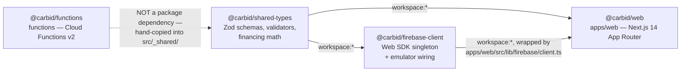
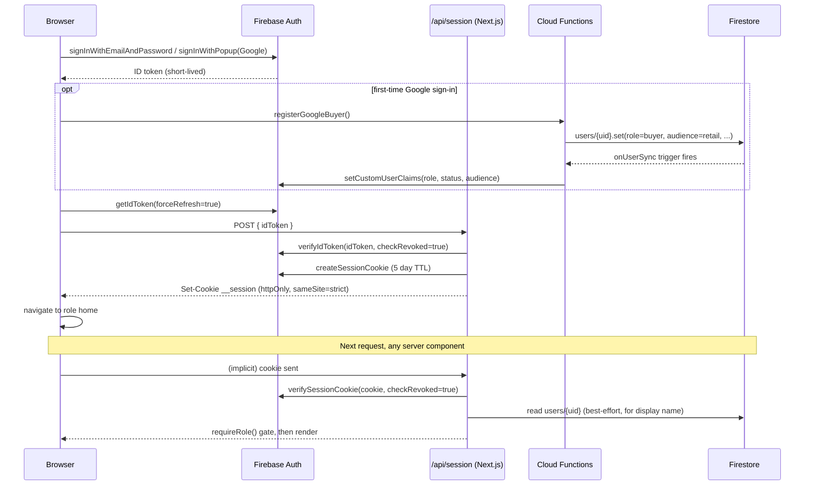
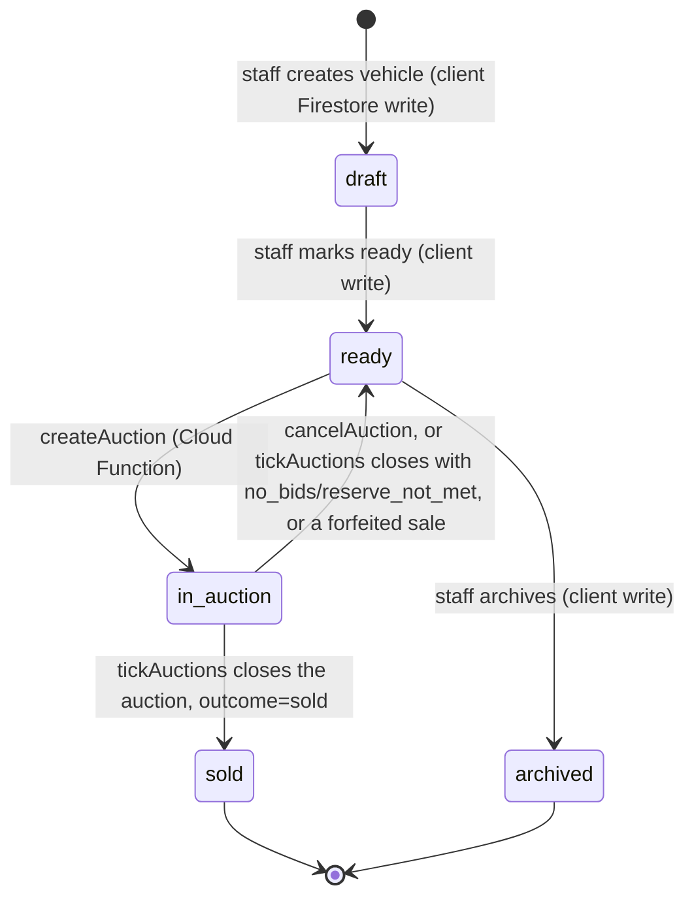
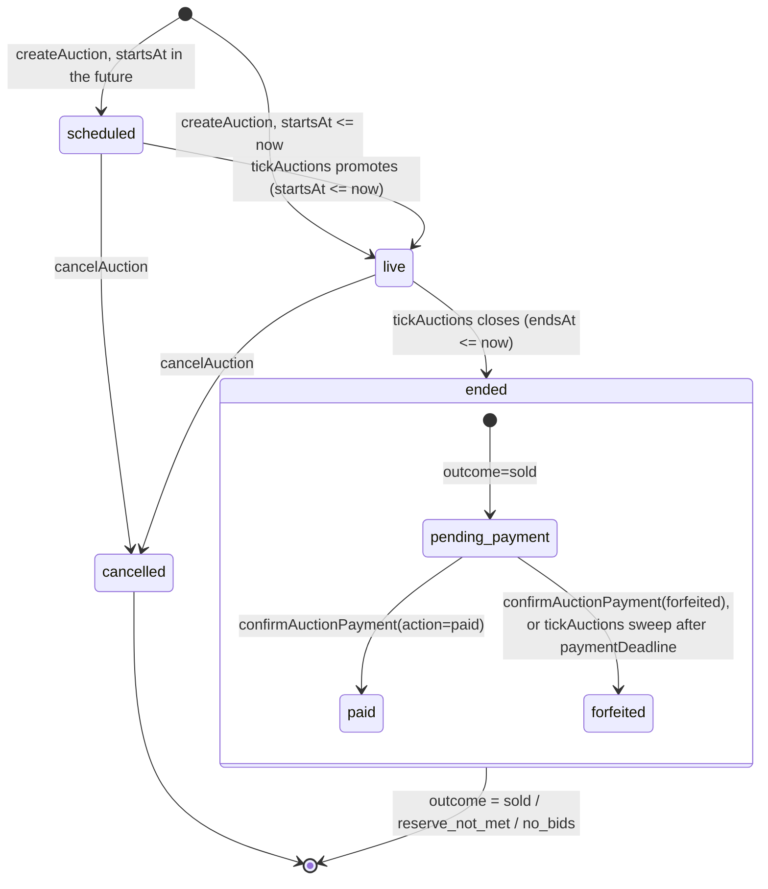

# CARBID / Renew Subastas — Architecture

This document describes the codebase as it exists on disk: the monorepo layout, the Firebase + Next.js stack, the Firestore data model, the auth/authorization system, and the core business flows. It is generated from and cross-checked against the actual source files cited throughout (paths are relative to the repo root).

---

## 1. Overview

**Renew Subastas** (package name `carbid`) is a web-based vehicle auction marketplace for **Santa Rosa Automotores** (Paraguay), branded publicly as "Renew Subastas" at `renewsubastas.com.py`. Staff photograph and list vehicles; buyers place timed, ascending bids; a winner pays a deposit ("seña") to secure the car; a finance role confirms or forfeits that deposit. All business rules — pricing, bidding, payment state, role provisioning — run server-side in Firebase Cloud Functions; the Next.js frontend is presentational and calls those functions or reads Firestore directly under security-rule constraints.

Four roles exist, defined in `packages/shared-types/src/user.ts` (`RoleSchema`) and enforced throughout the backend:

| Role                | Who                                   | Scope (per `docs/PRODUCT.md` and verified role checks below)                                                                                    |
| ------------------- | ------------------------------------- | ----------------------------------------------------------------------------------------------------------------------------------------------- |
| `admin`             | Few, high-trust, company-domain email | Full control: users of any role, all vehicles/auctions, global config, audit log, payment confirmation                                          |
| `staff`             | Operations                            | Loads vehicles, creates/runs auctions, onboards buyers/other staff — cannot create admins or confirm payments                                   |
| `finanzas`          | Finance                               | Sales ledger only: confirms/forfeits deposits, reads winner contact + payment proof; read-only elsewhere                                        |
| `buyer` (comprador) | Public bidders                        | Split into two non-overlapping **audiences**, `retail` and `wholesale` (`AudienceSchema`); a buyer only ever sees their own segment's catalogue |

Elevator pitch: Renew Subastas is a Firebase-native (Auth + Firestore + Storage + Cloud Functions) auction platform with a Next.js 14 App Router frontend, where every state-changing action of consequence — bidding, closing an auction, confirming money, granting a role — is mediated by a Cloud Function, and Firestore Security Rules exist as a second, independent line of defense rather than the primary authorization mechanism.

---

## 2. Monorepo layout

Package manager: **pnpm** workspaces (`pnpm@9.0.0`, root `package.json`), orchestrated by **Turborepo** (`turbo.json`). Workspace membership (`pnpm-workspace.yaml`):

```yaml
packages:
  - 'apps/*'
  - 'packages/*'
  - 'functions'
```

Only one app currently exists under `apps/*`. Despite `CLAUDE.md`'s aspirational monorepo sketch (`apps/mobile`, `apps/api`, etc.), the repository as it stands has exactly four workspace packages:

| Package                 | Path                       | Owns                                                                                               | package.json name         |
| ----------------------- | -------------------------- | -------------------------------------------------------------------------------------------------- | ------------------------- |
| Web app                 | `apps/web`                 | The entire Next.js 14 frontend (all roles, all locales)                                            | `@carbid/web`             |
| Cloud Functions         | `functions`                | All server-side business logic, deployed to Firebase                                               | `@carbid/functions`       |
| Shared types            | `packages/shared-types`    | Zod schemas + inferred TS types for the domain model, Paraguay document validators, financing math | `@carbid/shared-types`    |
| Firebase client wrapper | `packages/firebase-client` | Singleton Firebase Web SDK initialization (Auth/Firestore/Storage/Functions) + emulator wiring     | `@carbid/firebase-client` |

Root scripts (`package.json`) fan out through Turborepo: `dev`, `build`, `lint`, `typecheck`, `test` each run `turbo run <task>` across packages. `turbo.json` declares `build` depends on upstream packages' `build` (`dependsOn: ["^build"]`), which is why `shared-types` must compile to `dist/` before `web` or `functions` can consume it (see the explicit comment in `netlify.toml`: "shared-types must compile to dist/ before web can resolve it via package.json main").

### Dependency direction



`functions/package.json` does **not** list `@carbid/shared-types` as a dependency (verified: no `shared-types` reference anywhere under `functions/`, excluding compiled output). Instead, `functions/src/_shared/` is a **hand-maintained duplicate** of `packages/shared-types/src/`: `vehicle.ts`, `bid.ts`, `financing.ts`, `validators/paraguay.ts`, and `app-config.ts` are byte-identical between the two locations; `user.ts` differs only by two missing doc-comments in the `functions/src/_shared/` copy. There is no build step or script that syncs them — they are two independently-edited copies of the same schemas, verified via direct `diff`.

Inside `apps/web`, `src/lib/firebase/client.ts` calls `initFirebaseClient()`/`loadFirebaseEnv()` from `@carbid/firebase-client` and layers `initAppCheck()` on top — confirmed real usage, not just a declared dependency. `@carbid/shared-types` is imported directly in only two `apps/web` files (`lib/settings/update-profile.ts` and the `auctions/[id]/financing-calculator.tsx`, which reuses `calculateInstallment`); most of `apps/web/src/lib/*/load-*.ts` data loaders define their own local, view-specific TypeScript interfaces rather than importing the shared Zod-inferred types, even though the underlying Firestore documents conform to those schemas.

`apps/web` and `functions` each maintain their **own, separate** Firebase Admin SDK initialization: `apps/web/src/lib/firebase/admin.ts` (credentials from `FIREBASE_SERVICE_ACCOUNT_KEY` or split env vars, for Next.js server components) versus `functions/src/lib/admin.ts` (`applicationDefault()`, appropriate for the Cloud Functions runtime). These are two independent code paths, not a shared module.

---

## 3. Tech stack

Versions below are copied verbatim from the actual `package.json` files (no rounding/assuming).

### Frontend — `apps/web/package.json`

| Dependency                                                                  | Version                                                                                               | Purpose                                                                                                         |
| --------------------------------------------------------------------------- | ----------------------------------------------------------------------------------------------------- | --------------------------------------------------------------------------------------------------------------- |
| `next`                                                                      | `^14.2.0`                                                                                             | App Router, server components, route handlers                                                                   |
| `react` / `react-dom`                                                       | `^18.3.0`                                                                                             | UI runtime                                                                                                      |
| `next-intl`                                                                 | `^3.15.0`                                                                                             | Locale routing/i18n (`es`, `en`)                                                                                |
| `firebase`                                                                  | `^10.12.0`                                                                                            | Client SDK (Auth, Firestore, Storage, Functions, Messaging, App Check)                                          |
| `firebase-admin`                                                            | `^12.1.0`                                                                                             | Server-side Admin SDK for Next.js server components/route handlers                                              |
| `zod`                                                                       | `^3.25.76`                                                                                            | Form + runtime validation (note: newer than the `^3.23.0` used by `functions`/`shared-types`/`firebase-client`) |
| `react-hook-form` + `@hookform/resolvers`                                   | `^7.75.0` / `^5.2.2`                                                                                  | Form state + Zod resolver                                                                                       |
| `@radix-ui/react-*`                                                         | `^1.x`/`^2.x` (avatar, checkbox, dialog, dropdown-menu, label, select, separator, slot, switch, tabs) | Headless UI primitives behind `components/ui/*`                                                                 |
| `class-variance-authority`, `clsx`, `tailwind-merge`, `tailwindcss-animate` | `^0.7.1`, `^2.1.0`, `^2.3.0`, `^1.0.7`                                                                | shadcn/ui-style component variants                                                                              |
| `tailwindcss` (dev)                                                         | `^3.4.0`                                                                                              | Styling                                                                                                         |
| `motion`                                                                    | `^12.40.0`                                                                                            | Animation (the renamed Framer Motion package)                                                                   |
| `recharts`                                                                  | `^3.8.1`                                                                                              | Admin dashboard charts                                                                                          |
| `sonner`                                                                    | `^2.0.7`                                                                                              | Toasts                                                                                                          |
| `next-themes`                                                               | `^0.3.0`                                                                                              | Light/dark theme                                                                                                |
| `lucide-react`                                                              | `^1.14.0`                                                                                             | Icons                                                                                                           |
| `@sentry/nextjs`                                                            | `^10.51.0`                                                                                            | Error monitoring                                                                                                |
| `server-only`                                                               | `^0.0.1`                                                                                              | Compile-time guard on server modules                                                                            |
| `vitest` (dev)                                                              | `^1.6.0`                                                                                              | Unit tests (`vitest run --passWithNoTests` — no web unit tests currently enforced)                              |

### Backend — `functions/package.json`

| Dependency                                                   | Version                      | Purpose                                                                    |
| ------------------------------------------------------------ | ---------------------------- | -------------------------------------------------------------------------- |
| `firebase-functions`                                         | `^5.0.0`                     | Cloud Functions v2 SDK (`onCall`, `onSchedule`, `onDocumentWritten`, etc.) |
| `firebase-admin`                                             | `^12.1.0`                    | Server SDK (Auth, Firestore, Storage, Messaging)                           |
| `resend`                                                     | `^6.12.2`                    | Transactional email                                                        |
| `zod`                                                        | `^3.23.0`                    | Input validation on every callable                                         |
| `@sentry/node`                                               | `^10.51.0`                   | Error monitoring                                                           |
| `firebase-functions-test` (dev), `vitest` (dev), `tsx` (dev) | `^3.3.0`, `^1.6.0`, `^4.7.0` | Testing + script runner                                                    |

Build: `tsc` compiling `functions/src` → `functions/lib` (`main: lib/index.js`); Node **20** runtime (`engines.node: "20"`).

### Shared packages

| Package                    | Dependencies                                                             |
| -------------------------- | ------------------------------------------------------------------------ |
| `packages/shared-types`    | `zod ^3.23.0` (runtime); `vitest ^1.6.0` (dev)                           |
| `packages/firebase-client` | `firebase ^10.12.0`, `zod ^3.23.0`, `@carbid/shared-types (workspace:*)` |

### Cross-cutting

- **TypeScript**: `^5.4.0` (root), strict config shared via `tsconfig.base.json` (`strict`, `noUncheckedIndexedAccess`, `exactOptionalPropertyTypes`, `noImplicitOverride`, `ES2022` target, `Bundler` module resolution).
- **Node**: `>=20` everywhere (root `engines`, `.nvmrc`).
- **Turborepo**: `^2.0.0`. **ESLint** `^8.57.0` + `@typescript-eslint` `^8.59.2`. **Prettier** `^3.2.0`. **Husky** `^9.0.0` + `lint-staged` for pre-commit formatting.
- All four packages are ESM (`"type": "module"`).

---

## 4. Data model

Firestore collections below are drawn from `firestore.rules`, the Zod schemas in `packages/shared-types/src/*.ts`, and the actual writer code in `functions/src/`. "Client write" means a browser can write it directly through the Firestore SDK under rules; "server write" means only the Admin SDK (a Cloud Function, which bypasses rules) ever writes it.

| Collection                                   | Schema                                                       | Written by                                                                                                                                                                                                                                                                                                                                                                                                                                                           | Read by                                                                                                                                                                                              | Notes                                                                                                                                                                                                                                                                            |
| -------------------------------------------- | ------------------------------------------------------------ | -------------------------------------------------------------------------------------------------------------------------------------------------------------------------------------------------------------------------------------------------------------------------------------------------------------------------------------------------------------------------------------------------------------------------------------------------------------------- | ---------------------------------------------------------------------------------------------------------------------------------------------------------------------------------------------------- | -------------------------------------------------------------------------------------------------------------------------------------------------------------------------------------------------------------------------------------------------------------------------------- | ------------------------------------------------------------------------------------------ | --------------------------------------------------------------------- |
| `users/{uid}`                                | `UserSchema` (`shared-types/user.ts`)                        | **Server**: `createUser`, `updateUserRole`, `deleteUser`, `hardDeleteUser`, `registerGoogleBuyer` (all via Admin SDK). **Client, allow-listed**: only the `favorites` field, via `arrayUnion`/`arrayRemove` (`auction-card.tsx`) — the rule `request.resource.data.diff(resource.data).affectedKeys().hasOnly(['favorites'])` blocks every other field from client writes. `fcmTokens` (array of `{token, platform, updatedAt}`) is written only by `savePushToken`. | Owner reads own doc; `admin` reads all (`firestore.rules`)                                                                                                                                           | `onUserSync` (`onDocumentWritten` trigger) mirrors `role`/`status`/`profile.audience` from every write into the user's custom claims                                                                                                                                             |
| `vehicles/{id}`                              | `VehicleSchema` (`shared-types/vehicle.ts`)                  | **Client**: `staff`/`admin` create and update directly via the Firestore SDK (`staff/vehicles/new/vehicle-form.tsx`, `staff/vehicles/[id]/edit-vehicle-form.tsx`) — there is **no** `createVehicle`/`updateVehicle` Cloud Function; the security rule (`allow create, update: if isStaff()                                                                                                                                                                           |                                                                                                                                                                                                      | isAdmin();`) is the sole gate. **Server**: `createAuction`flips status to`in_auction`and stamps`firstListedAt`; `tickAuctions`/`cancelAuction`/`confirmAuctionPayment`flip status between`ready`/`sold`; `deleteVehicle` (Cloud Function) hard-deletes the doc + Storage images. | `admin`/`staff`/`finanzas` read all; `buyer` reads only vehicles matching their `audience` | Status machine: `draft → ready → in_auction → sold/archived` (see §7) |
| `auctions/{id}`                              | `AuctionSchema` (`shared-types/auction.ts`)                  | **Server only** — rules explicitly deny all client create/update/delete (`allow create, update, delete: if false;`). Written exclusively by `createAuction`, `updateAuction`, `cancelAuction`, `deleteAuction`, `placeBid`, `tickAuctions`, `confirmAuctionPayment`, `submitPaymentProof`.                                                                                                                                                                           | `admin`/`staff`/`finanzas` read all; `buyer` reads only their audience's auctions                                                                                                                    | Carries a denormalized `vehicleSnapshot` (make/model/year/thumbnail) and live `viewStats.{total,unique}`                                                                                                                                                                         |
| `auctions/{id}/bids/{bidId}`                 | `BidSchema` (`shared-types/bid.ts`)                          | Server only, inside `placeBid`'s transaction                                                                                                                                                                                                                                                                                                                                                                                                                         | `admin`/`staff` read all; `buyer` reads bids only for auctions matching their own audience (rule re-checks the parent auction's `audience` field, since Firestore evaluates each rule independently) | A `{path=**}/bids/{bidId}` collection-group rule additionally allows `admin`/`staff`/`finanzas` to read bids across _all_ auctions (powers the notification bell and the admin dashboard's "bids per day" chart)                                                                 |
| `auctions/{id}/viewers/{viewerUid}`          | Ad hoc (not in `shared-types`)                               | Server only, inside `logAuctionView`'s transaction                                                                                                                                                                                                                                                                                                                                                                                                                   | `admin`/`staff` only                                                                                                                                                                                 | One doc per distinct buyer who viewed the auction: `{uid, firstName, lastInitial, firstViewAt, lastViewAt, viewCount}`                                                                                                                                                           |
| `auctions/{id}/priceChanges/{changeId}`      | Ad hoc                                                       | Server only, inside `updateAuction` (best-effort, non-blocking)                                                                                                                                                                                                                                                                                                                                                                                                      | `admin`/`staff` only                                                                                                                                                                                 | One doc per `startingPrice`/`reservePrice` edit: `{field, from, to, isReduction, actorUid, actorName, at}`                                                                                                                                                                       |
| `rate_limits/{key}`                          | Ad hoc                                                       | Server only                                                                                                                                                                                                                                                                                                                                                                                                                                                          | **No client access at all** — no rule block matches `rate_limits`, so Firestore's default-deny applies                                                                                               | Keys: `bids_{uid}` (`placeBid`), `views_{uid}` (`logAuctionView`), `pwreset_{base64(email)}` (`requestPasswordReset`); each stores a sliding-window `timestamps: number[]`                                                                                                       |
| `audit_logs/{id}`                            | Ad hoc (`writeAuditLog`, `functions/src/lib/audit.ts`)       | Server only (every mutating callable calls `writeAuditLog`)                                                                                                                                                                                                                                                                                                                                                                                                          | `admin` only                                                                                                                                                                                         | `{actorUid, action, resourceType, resourceId, before?, after?, createdAt}`                                                                                                                                                                                                       |
| `app_config/{doc}` (single doc, id `global`) | `AppConfigSchema` (`shared-types/app-config.ts`)             | Server only, via `updateGlobalConfig` (admin)                                                                                                                                                                                                                                                                                                                                                                                                                        | Any signed-in **active** user                                                                                                                                                                        | Holds `currency`, `bid` (increment/anti-sniping), `financing`, `emails`, and `payment` (bank accounts, deposit %, deadline hours) sub-objects; read with defaults-merge fallback by `functions/src/lib/config.ts:loadAppConfig()`                                                |
| `notifications/{id}`                         | Ad hoc (`recordNotification`, `functions/src/lib/notify.ts`) | Server only, from `sendBidOutbid`/`sendAuctionWon`                                                                                                                                                                                                                                                                                                                                                                                                                   | `admin`/`staff` only                                                                                                                                                                                 | Delivery-outcome log (`sent`/`skipped`/`failed` + reason) surfaced in the staff "Pujas" panel                                                                                                                                                                                    |
| `password_reset_requests/{id}`               | Ad hoc                                                       | **Create**: server only (`requestPasswordReset`, unauthenticated + rate-limited). **Read/update/delete**: `admin` only                                                                                                                                                                                                                                                                                                                                               | `admin` only                                                                                                                                                                                         | Human-mediated reset queue — an admin manually verifies identity and calls `generatePasswordReset`                                                                                                                                                                               |
| `password_set_tokens/{id}`                   | Ad hoc (`functions/src/auth/reset-tokens.ts`)                | Server only                                                                                                                                                                                                                                                                                                                                                                                                                                                          | **No client access at all** (`allow read, write: if false;`)                                                                                                                                         | Doc id is the SHA-256 hash of a random 256-bit token; the raw token only ever exists in the emailed link. 72-hour TTL, single-use (`usedAt`)                                                                                                                                     |

### Storage (`storage.rules`)

| Path                                    | Read                           | Write                                                                                                                                                                              |
| --------------------------------------- | ------------------------------ | ---------------------------------------------------------------------------------------------------------------------------------------------------------------------------------- |
| `vehicles/{vehicleId}/**`               | Any active signed-in user      | `staff`/`admin`, ≤10 MB, `image/*` only                                                                                                                                            |
| `payment-proofs/{auctionId}/{fileName}` | `staff`/`admin`/`finanzas`     | Any active `buyer`, but only a filename prefixed with their own uid (`{uid}-{ts}.{ext}`); `submitPaymentProof` separately re-verifies the caller is the auction's real `winnerUid` |
| `avatars/{uid}/**`                      | Public (`allow read: if true`) | Owner only, ≤2 MB, `image/*`                                                                                                                                                       |

Audience scoping for vehicle photos is **not** enforced at the Storage layer (rules comment explains this explicitly) — it relies on the application layer never surfacing a cross-audience vehicle/auction id to the client in the first place.

---

## 5. Auth & session model

Firebase Authentication is the identity provider; a **session cookie**, not the Firebase ID token, is what Next.js server code actually trusts.

### Custom claims

`functions/src/lib/claims.ts` defines the claims shape: `{ role: 'admin'|'staff'|'finanzas'|'buyer', status: 'active'|'disabled', audience?: 'retail'|'wholesale' }`. Claims are set in exactly two places:

1. **`onUserSync`** (`functions/src/auth/onUserSync.ts`, `onDocumentWritten` on `users/{uid}`) — fires on _every_ write to a user doc (create, update, or the doc disappearing) and derives claims straight from the document: `role`, `status`, and (for buyers) `profile.audience`. If the doc is deleted or carries `deletedAt`, claims are cleared entirely. This is the single source of truth keeping claims in sync with Firestore.
2. Direct `setUserClaims()` calls inside `createUser`, `updateUserRole`, and `registerGoogleBuyer`, done **in addition to** the Firestore write so the very next token refresh already carries the new claims without waiting on the trigger to fire.

### Password login

```
LoginForm (apps/web/.../login-form.tsx)
  → signInWithEmailAndPassword (Firebase client SDK)
  → cred.user.getIdToken(true)          // force-refresh
  → postSession(idToken)                // POST /api/session
  → router.replace(homeFor(role, audience))
```

### Google self-registration (retail buyers)

```
GoogleSignInButton
  → signInWithPopup(GoogleAuthProvider)
  → httpsCallable('registerGoogleBuyer')()   // provisions users/{uid} if new
  → cred.user.getIdToken(true)               // pick up the freshly-set claims
  → postSession(idToken)
```

`registerGoogleBuyerHandler` (`functions/src/auth/registerGoogleBuyer.ts`) deliberately does **not** call `requireSignedIn` (a first-time Google user has no claims yet). It requires only `token.firebase.sign_in_provider === 'google.com'` and `token.email_verified === true`, then: if `users/{uid}` already exists, it returns the existing `role`/`audience` unchanged (never overwrites a staff/admin account that happens to share the Google email); otherwise it force-creates a **`buyer` + `retail`** user document and calls `setUserClaims` directly. The client can supply no role/audience — both are hardcoded server-side.

### Session cookie

`POST /api/session` (`apps/web/src/app/api/session/route.ts`):

1. Same-origin check (`Origin`/`Sec-Fetch-Site` header comparison against `Host`) before touching auth — blocks a third-party page from minting a session cookie for this domain.
2. `adminAuth().verifyIdToken(idToken, true)` (the `true` checks revocation).
3. Rejects if `status !== 'active'`.
4. `adminAuth().createSessionCookie(idToken, { expiresIn: SESSION_TTL_MS })`, `SESSION_TTL_MS = 5 days` (`lib/auth/constants.ts`).
5. Sets cookie `__session`: `httpOnly`, `secure` in production, **`sameSite: 'strict'`**, `path: '/'`.
6. `DELETE /api/session` clears it (used on logout and on stale-session recovery).

### Server-side resolution

`getCurrentUser(locale)` (`apps/web/src/lib/auth/server.ts`), wrapped in React's `cache()` so one request shares a single Firestore read + `verifySessionCookie` call across nested server components:

1. No cookie → `redirect('/login')`.
2. `adminAuth().verifySessionCookie(cookie, /* checkRevoked */ true)`.
3. `status !== 'active'` → redirect with `?error=disabled`. No `role` claim → `?error=no_role`.
4. Best-effort Firestore read of `users/{uid}` for a friendly `firstName` and (for buyers) `audience`, falling back to deriving a name from the email local-part.
5. Any other failure (expired/revoked cookie) → redirect with `?error=expired`; the login page detects that query param on mount and clears both the stale `__session` cookie and client Firebase auth state to break any redirect loop.

`requireRole(locale, allowed[])` calls `getCurrentUser` then redirects to the caller's own home (`homeFor(role, audience)`) if their role isn't in the allow-list.

### Claims-refresh / revocation lifecycle



When `updateUserRole` changes role/status/audience, it calls `adminAuth().revokeRefreshTokens(uid)` **on any actual change** (not only on disable) — because `verifySessionCookie(..., true)`'s revocation check is what forces the next `getCurrentUser` call to fail and redirect to `/login?error=expired`, re-minting the session (and thus the claims) instead of trusting a cookie that can otherwise live for up to 5 more days. `redeemPasswordReset` and `deleteUser`/`hardDeleteUser` similarly revoke refresh tokens. `revokeMySessions` exposes the same primitive as a self-service "log out everywhere" callable.

---

## 6. Authorization model

Three independent layers enforce access. None of them is "the" authorization system on its own — a client-side page guard can be skipped by calling a Cloud Function directly, and a Cloud Function check means nothing if the Firestore rule for the same collection is permissive; the security rules are the last line of defense, not the only one, because **Next.js server components read Firestore through the Admin SDK, which bypasses rules entirely**. This is explicit in code: `apps/web/src/app/[locale]/(protected)/auctions/[id]/page.tsx` re-implements the same audience check the Firestore rule performs, with the comment _"loadAuction reads via the Admin SDK, which bypasses firestore.rules — mirror the same audience gate the rules enforce."_

| Layer                         | Mechanism                                                                                                                                                                                                    | Example                                                                                                             |
| ----------------------------- | ------------------------------------------------------------------------------------------------------------------------------------------------------------------------------------------------------------ | ------------------------------------------------------------------------------------------------------------------- |
| 1. Firestore / Storage rules  | `firestore.rules`, `storage.rules` — the only gate for **client-direct** writes (vehicles, `favorites`) and all client reads                                                                                 | `allow create, update: if isStaff() \|\| isAdmin();` on `vehicles/{id}`                                             |
| 2. Cloud Function role checks | `requireSignedIn`/`requireAdmin` (`functions/src/lib/errors.ts`) plus inline `if (role !== ...)` checks in each handler                                                                                      | `placeBid` rejects any caller whose role isn't `buyer`                                                              |
| 3. Next.js server-side guards | `requireRole()` in route-group `layout.tsx` files, sometimes narrowed further by an additional `requireRole()` inside a specific `page.tsx`, plus manual re-checks in data loaders reading via the Admin SDK | `staff/layout.tsx` allows `admin`+`staff`+`finanzas`, but `staff/insights/page.tsx` narrows to `admin`+`staff` only |

Route-group guards (all under `apps/web/src/app/[locale]/(protected)/`):

| Layout                          | Allowed roles                                                                                                                                                              |
| ------------------------------- | -------------------------------------------------------------------------------------------------------------------------------------------------------------------------- |
| `admin/layout.tsx`              | `admin`                                                                                                                                                                    |
| `staff/layout.tsx`              | `admin`, `staff`, `finanzas` (finanzas needs `staff/auctions/[id]` to confirm a seña; the layout comment notes page-level guards keep finanzas out of create/edit actions) |
| `sales/layout.tsx`              | `admin`, `finanzas`                                                                                                                                                        |
| `[audience]/layout.tsx`         | any authenticated user, but a `buyer` is redirected to their _own_ audience if the URL segment doesn't match; `admin`/`staff` may view either side                         |
| `settings/danger-zone/page.tsx` | `buyer` only (self-account deletion isn't offered to staff/admin)                                                                                                          |

### Role capability matrix

Grounded in the actual `requireSignedIn`/`requireAdmin` calls and inline role checks read in each Cloud Function, plus the Firestore rule conditions above.

| Capability                                                 | admin                                                       | staff                            | finanzas                                  | buyer                                     |
| ---------------------------------------------------------- | ----------------------------------------------------------- | -------------------------------- | ----------------------------------------- | ----------------------------------------- |
| Create a user (any role)                                   | ✅ (`createUser`)                                           | ✅ buyers + staff, **not** admin | ❌                                        | ❌                                        |
| Change a user's role/status/audience                       | ✅ (`updateUserRole`, `requireAdmin`)                       | ❌                               | ❌                                        | ❌                                        |
| Soft-delete a user                                         | ✅ any non-admin (`deleteUser`)                             | ❌                               | ❌                                        | ✅ **own account only**                   |
| Hard-delete a user                                         | ✅ non-admin, already disabled, not self (`hardDeleteUser`) | ❌                               | ❌                                        | ❌                                        |
| Generate a reset link for someone else                     | ✅ (`generatePasswordReset`, `requireAdmin`)                | ❌                               | ❌                                        | ❌                                        |
| Revoke own sessions                                        | ✅                                                          | ✅                               | ✅                                        | ✅ (`revokeMySessions`, any active role)  |
| Create/edit vehicles                                       | ✅ (rule)                                                   | ✅ (rule)                        | ❌ (read-only)                            | ❌                                        |
| Delete a vehicle                                           | ✅ (`deleteVehicle`)                                        | ✅                               | ❌                                        | ❌                                        |
| Create/edit/cancel/delete an auction                       | ✅                                                          | ✅                               | ❌                                        | ❌                                        |
| Place a bid                                                | ❌ (explicitly excluded — anti shill-bidding)               | ❌                               | ❌                                        | ✅, own audience only                     |
| View bidder contact info (Pujas panel)                     | ✅ (`resolveBidders`)                                       | ✅                               | ❌                                        | ❌                                        |
| View winner contact info                                   | ✅ (`getWinnerContact`)                                     | ❌                               | ✅                                        | ❌                                        |
| Confirm / forfeit a payment                                | ✅ (`confirmAuctionPayment`)                                | ❌                               | ✅                                        | ❌                                        |
| Submit a payment proof                                     | ❌                                                          | ❌                               | ❌                                        | ✅, only the auction's actual `winnerUid` |
| Edit global config (bank data, fees, anti-sniping window)  | ✅ (`updateGlobalConfig`, `requireAdmin`)                   | ❌                               | ❌                                        | ❌                                        |
| Read audit log                                             | ✅ (rule: `isAdmin()`)                                      | ❌                               | ❌                                        | ❌                                        |
| Read `/staff/insights` (views/price history/unsold digest) | ✅                                                          | ✅                               | ❌ (page-level `requireRole` excludes it) | ❌                                        |

---

## 7. Core domain flows

### Vehicle and auction lifecycle





`tickAuctions` (`functions/src/auctions/tickAuctions.ts`, `onSchedule('every 1 minutes')`) runs three independent, individually try/caught passes so one bad auction can't wedge the rest:

1. **Promote**: `status=scheduled AND startsAt<=now` → `live` (batched, limit 200).
2. **Close**: `status=live AND endsAt<=now` → `ended`, computing `outcome` from `currentBid`/`reservePrice`/`currentBidderUid` inside a per-auction transaction. On `sold`, stamps `paymentStatus=pending_payment`, `paymentDepositUsd` (from `app_config.payment.depositPercent`, default 10%), and `paymentDeadline` (`app_config.payment.deadlineHours`, default 24h). The linked vehicle flips to `sold` or back to `ready`.
3. **Forfeit sweep**: `status=ended AND outcome=sold AND paymentStatus=pending_payment AND paymentDeadline<=now` → `paymentStatus=forfeited`, vehicle back to `ready`. Re-checks `paymentStatus` inside the transaction so a payment an admin just confirmed can't be clobbered by a sweep that started before the confirmation landed.

### Placing a bid — `placeBid` (`functions/src/auctions/placeBid.ts`)

1. `requireSignedIn` + role must be exactly `buyer` (admins/staff are blocked to prevent shill-bidding).
2. Zod-validate `{auctionId, amount}`; amount capped at `app_config.bid.maxBidUsd` (default `200,000`) and snapped to cents.
3. Buyer profile must already have `documentType`/`documentNumber` (blocks Google self-registered buyers who haven't completed their profile — `failed-precondition: profile_incomplete`).
4. Single Firestore transaction:
   - Reads `rate_limits/bids_{uid}` first and enforces **10 bids/minute**, sliding window — read-check-write happens _inside_ the transaction so concurrent bids from the same buyer can't all pass the check before any of them writes.
   - Re-reads the auction; rejects if not `live`, if the audience doesn't match the buyer's own audience claim, if already ended, or if the caller is already the current top bidder (self-outbid is disallowed).
   - Computes `minRequired = currentBid>0 ? currentBid+bidIncrement : startingPrice`.
   - **Anti-sniping**: if `endsAt - now < antiSnipingSeconds` (`app_config.bid.antiSnipingSeconds`, default 60s), extends `endsAt` to `now + antiSnipingSeconds`.
   - Marks the previous winning bid `outbid`, writes the new bid doc (`status: 'winning'`, carrying `displacedBuyerUid`/`displacedAmount` so the outbid email doesn't need a second query), and updates the auction's `currentBid`/`currentBidderUid`/`bidCount`/`endsAt`.
5. The new bid doc triggers `sendBidOutbid` (`onDocumentCreated`), which emails the displaced bidder and logs the outcome to `notifications`.

### Winning and payment

```
tickAuctions closes auction (outcome=sold)
  → sendAuctionWon (onDocumentUpdated, fires on the ended+sold transition only)
      → emails winner: bank details, deposit amount, deadline
  → buyer uploads a receipt to Storage: payment-proofs/{auctionId}/{uid}-{ts}.{ext}
  → submitPaymentProof(auctionId, storagePath)
      - verifies uid === auction.winnerUid, status is still pending_payment
      - records paymentProofPath/paymentProofUrl on the auction
      - downloads the file and emails administración (CC rsanchez, BCC croman) the full buyer + vehicle dossier with the receipt attached
  → admin or finanzas calls confirmAuctionPayment(auctionId, action: 'paid'|'forfeited')
      - 'paid': stamps paymentStatus, emails the buyer a confirmation and emails the sales lead an invoicing notice
      - 'forfeited': stamps paymentStatus, returns the vehicle to status=ready
  → (if never confirmed) tickAuctions' forfeit sweep auto-forfeits after paymentDeadline
```

### Google self-registration → buyer provisioning

See §5. In one round trip, `registerGoogleBuyer` either resolves an existing account's real role/audience or creates a brand-new `buyer`/`retail`/`active` user doc, sets matching custom claims directly (not waiting for `onUserSync`), and writes a best-effort audit log entry (`user.self_register`) that must not fail the registration itself.

### Insights / reporting pipeline

1. **View tracking**: `ViewTracker` (`apps/web/src/components/insights/view-tracker.tsx`), a headless component mounted on the buyer auction-detail page, fires the `logAuctionView` callable at most once per 30 minutes per auction per browser tab (`sessionStorage` throttle) and swallows all errors. `logAuctionViewHandler` (`functions/src/insights/logAuctionView.ts`) is a no-op for non-buyers, rate-limits at 20/min/user, and inside one transaction upserts `auctions/{id}/viewers/{uid}` and increments `auctions/{id}.viewStats.{total, unique}`.
2. **Price-change history**: `updateAuction` diffs `startingPrice`/`reservePrice` against the pre-edit auction doc and best-effort-writes one `priceChanges` doc per changed field (`{field, from, to, isReduction, actorUid, actorName, at}`); a failure here never blocks the already-committed price edit or the audit log write.
3. **Unsold digest**: `dailyUnsoldDigest` (`onSchedule('0 9 * * *', timeZone: 'America/Asuncion')`) paginates all vehicles with `firstListedAt` ≥7 days old, not `sold`/`archived`, and not yet `unsoldAlertAt`-marked; enriches each with aggregated `viewStats.unique` and `priceChanges` reduction counts across its auctions; emails one digest to every active `admin`/`staff`; marks `unsoldAlertAt` only _after_ the email succeeds (so a Resend outage retries the whole batch the next day) and only if there's at least one recipient.
4. **Staff report UI**: `lib/insights/load-insights.ts` (list view, `/staff/insights`) and `lib/insights/load-vehicle-insight.ts` (detail view, `/staff/insights/[vehicleId]`) are pure Admin-SDK read aggregations — no Cloud Function involved for reading, only for writing the underlying counters.

---

## 8. Cloud Functions inventory

All 29 functions exported from `functions/src/index.ts`, region `us-central1` unless noted. Every `onCall` function except `pingHealth`, `requestPasswordReset`, and `redeemPasswordReset` calls `requireSignedIn`/`requireAdmin` before doing anything else; the three exceptions are intentionally reachable by an unauthenticated or not-yet-provisioned caller (health check, forgot-password request, and password-set redemption respectively).

### Auth (10)

| Function                                                            | Trigger                             | Purpose                                                                                                                      |
| ------------------------------------------------------------------- | ----------------------------------- | ---------------------------------------------------------------------------------------------------------------------------- |
| `createUser`                                                        | `onCall`                            | Admin creates any role; staff creates buyers/staff only. Issues a password-set link, emails a welcome message                |
| `updateUserRole`                                                    | `onCall`                            | Admin-only role/status/audience change; last-active-admin guard; revokes sessions on any claims change                       |
| `deleteUser`                                                        | `onCall`                            | Soft-disable: admin on any non-admin, or a buyer on their own account                                                        |
| `hardDeleteUser`                                                    | `onCall`                            | Admin-only permanent delete of an already-disabled, non-admin, non-self user                                                 |
| `onUserSync`                                                        | `onDocumentWritten` (`users/{uid}`) | Mirrors `role`/`status`/`audience` from Firestore into custom claims on every write; clears claims on delete                 |
| `generatePasswordReset` (exported as such from `changePassword.ts`) | `onCall`                            | Admin generates + emails a password-set link for any user                                                                    |
| `redeemPasswordReset`                                               | `onCall` (unauthenticated)          | Consumes a single-use token, sets the new password, revokes existing sessions                                                |
| `requestPasswordReset`                                              | `onCall` (unauthenticated)          | Buyer requests a reset; rate-limited (3/hour/email); creates a `password_reset_requests` doc for an admin to action manually |
| `revokeMySessions`                                                  | `onCall`                            | Any signed-in user invalidates their own refresh tokens                                                                      |
| `registerGoogleBuyer`                                               | `onCall`                            | Google-authenticated self-registration; force-provisions `buyer`/`retail` for new users, no-ops for existing accounts        |

### Auctions (10)

| Function                | Trigger                         | Purpose                                                                                                  |
| ----------------------- | ------------------------------- | -------------------------------------------------------------------------------------------------------- |
| `createAuction`         | `onCall`                        | Staff/admin schedules an auction from a `ready` vehicle; flips vehicle to `in_auction`                   |
| `updateAuction`         | `onCall`                        | Edits an auction; full edit while `scheduled`, extend-only `endsAt` while `live`; records `priceChanges` |
| `cancelAuction`         | `onCall`                        | Staff/admin cancels a non-ended auction; frees the vehicle back to `ready`                               |
| `deleteAuction`         | `onCall`                        | Staff/admin permanently deletes a `scheduled`/`cancelled`/no-winner `ended` auction                      |
| `placeBid`              | `onCall`, App Check enforced    | Buyer bids; transactional rate limit, anti-sniping, min-increment, audience gate (see §7)                |
| `tickAuctions`          | `onSchedule('every 1 minutes')` | Promotes `scheduled→live`, closes `live→ended`, sweeps expired `pending_payment→forfeited`               |
| `confirmAuctionPayment` | `onCall`, App Check enforced    | Admin/finanzas marks a sold auction `paid` or `forfeited`; emails buyer + sales lead on `paid`           |
| `submitPaymentProof`    | `onCall`, App Check enforced    | Winner uploads a receipt; verified against `winnerUid`; emails administración with the attachment        |
| `getWinnerContact`      | `onCall`                        | Admin/finanzas resolves a winner's name/email/phone, narrowly scoped to an actual `winnerUid`            |
| `resolveBidders`        | `onCall`                        | Admin/staff bulk-resolves up to 50 bidder contacts for the Pujas panel                                   |

### Vehicles (1)

| Function        | Trigger  | Purpose                                                                                    |
| --------------- | -------- | ------------------------------------------------------------------------------------------ |
| `deleteVehicle` | `onCall` | Admin/staff permanently deletes a vehicle (not `in_auction`/`sold`) and its Storage images |

### Config (1)

| Function             | Trigger  | Purpose                                                                                                                    |
| -------------------- | -------- | -------------------------------------------------------------------------------------------------------------------------- |
| `updateGlobalConfig` | `onCall` | Admin-only partial update of `app_config/global` (currency, bid rules, financing, email sender, bank/payment instructions) |

### Notifications (4)

| Function          | Trigger                                            | Purpose                                                                                          |
| ----------------- | -------------------------------------------------- | ------------------------------------------------------------------------------------------------ |
| `sendBidOutbid`   | `onDocumentCreated` (`auctions/{id}/bids/{bidId}`) | Emails the just-displaced bidder ("te superaron")                                                |
| `sendAuctionWon`  | `onDocumentUpdated` (`auctions/{id}`)              | Emails the winner on the transition into `ended`+`sold` only                                     |
| `sendAuctionLive` | `onDocumentWritten` (`auctions/{id}`)              | FCM web-push fanout to every active buyer in the matching audience on the transition into `live` |
| `savePushToken`   | `onCall`                                           | Registers/refreshes an FCM token on the caller's user doc (max 10 per user)                      |

### Insights (2)

| Function            | Trigger                                     | Purpose                                                            |
| ------------------- | ------------------------------------------- | ------------------------------------------------------------------ |
| `logAuctionView`    | `onCall`, App Check enforced                | Buyer-only view logging with aggregated counters and rate limiting |
| `dailyUnsoldDigest` | `onSchedule('0 9 * * *', America/Asuncion)` | Emails admin/staff a digest of vehicles unsold ≥7 days             |

### Misc (1)

| Function     | Trigger                    | Purpose                                                      |
| ------------ | -------------------------- | ------------------------------------------------------------ |
| `pingHealth` | `onCall` (unauthenticated) | Returns `{status:'ok', timestamp}` — liveness check, no auth |

---

## 9. Frontend structure

`apps/web/src/app` is a Next.js **App Router** tree with locale-based i18n via `next-intl` (`middleware.ts`, locales `es`/`en`, default `es`) and two top-level route groups under `[locale]/`:

```
app/
├── api/session/route.ts          # POST/DELETE session-cookie endpoint (§5)
└── [locale]/
    ├── layout.tsx                 # root locale layout
    ├── page.tsx                   # public landing
    ├── (auth)/                    # unauthenticated routes
    │   ├── login/                 # login-form.tsx, google-signin-button.tsx, forgot-password-dialog.tsx
    │   └── auth/{action,set-password}/
    └── (protected)/
        ├── layout.tsx              # wraps everything in <AppShell> (topbar + sidebar + notification bell)
        ├── admin/                  # requireRole(['admin'])
        │   ├── users/, users/new/, users/[uid]/
        │   ├── audit/, config/, password-resets/, sales/
        ├── staff/                  # requireRole(['admin','staff','finanzas'])
        │   ├── vehicles/, vehicles/new/, vehicles/[id]/
        │   ├── auctions/, auctions/new/, auctions/[id]/
        │   ├── buyers/, buyers/new/
        │   ├── bids/, bids/bidder/[uid]/       # "Pujas" panel
        │   └── insights/, insights/[vehicleId]/  # requireRole(['admin','staff']) — narrower than the layout
        ├── sales/                  # requireRole(['admin','finanzas']) — sales ledger
        ├── auctions/[id]/          # buyer-facing auction detail (bid-panel, financing-calculator, ViewTracker)
        ├── [audience]/             # requireRole any; buyer confined to own audience — retail/wholesale home, bids/, won/[auctionId]/
        └── settings/               # profile/, security/, preferences/, danger-zone/ (buyer-only)
```

`(protected)/layout.tsx` renders `<AppShell>` (`components/shell/app-shell.tsx`), which itself calls `getCurrentUser()` (the only sign-in check at that level) and builds the sidebar from `getNavItems(role, ...)`. The actual **role restriction** for each subtree lives one level down, in each subtree's own `layout.tsx` calling `requireRole()` — meaning a signed-in buyer never reaches `/admin` past the layout, even though `AppShell` itself doesn't block anyone.

### Shared code

| Path                                                                                                                            | Contents                                                                                                                                                                                           |
| ------------------------------------------------------------------------------------------------------------------------------- | -------------------------------------------------------------------------------------------------------------------------------------------------------------------------------------------------- |
| `src/lib/auth/`                                                                                                                 | `server.ts` (`getCurrentUser`, `requireRole`), `post-session.ts` (client-side session exchange + open-redirect guard), `constants.ts` (`homeFor`, `SESSION_COOKIE_NAME`/`TTL`), `AuthProvider.tsx` |
| `src/lib/firebase/`                                                                                                             | `client.ts` (wraps `@carbid/firebase-client`), `admin.ts` (Next.js-local Admin SDK init), `app-check.ts`, `messaging.ts` (FCM web push, §10)                                                       |
| `src/lib/admin/`, `src/lib/staff/`, `src/lib/buyer/`, `src/lib/insights/`, `src/lib/settings/`                                  | Server-only (`'server-only'`) Admin-SDK data loaders, one file per dashboard/list/report, each returning a bespoke local TS interface                                                              |
| `src/lib/geo/`, `src/lib/format/`                                                                                               | Paraguay-specific formatting/geo helpers                                                                                                                                                           |
| `src/components/ui/`                                                                                                            | shadcn/ui-style primitives over Radix (`button`, `dialog`, `dropdown-menu`, `select`, `table`, `tabs`, `form`, etc.)                                                                               |
| `src/components/shell/`                                                                                                         | `app-shell.tsx`, `topbar.tsx`, `sidebar-nav.tsx`, `nav-config.tsx`, `notification-bell.tsx`, `push-permission-prompt.tsx`, `route-progress.tsx`                                                    |
| `src/components/brand/`, `src/components/motion/`, `src/components/theme/`, `src/components/forms/`, `src/components/insights/` | Brand marks/wordmark, scroll/reveal animation wrappers, theme toggle, shared form fields, `view-tracker.tsx`                                                                                       |
| `apps/web/messages/{es,en}.json` + `src/i18n.ts`                                                                                | `next-intl` message catalogs                                                                                                                                                                       |

Auction editing (`updateAuction`), vehicle CRUD (direct Firestore writes, §4), and payment flows (`submitPaymentProof`/`confirmAuctionPayment`) are all invoked from client components via `httpsCallable(fb.functions, '<name>')`, using the singleton `fb` object exported by `src/lib/firebase/client.ts`.

---

## 10. Email & notifications

### Transactional email — Resend

`functions/src/lib/email.ts` wraps the `resend` SDK behind `sendEmail()`. The API key is a Firebase Functions **secret** (`defineSecret('RESEND_API_KEY')`); if unset, `sendEmail` no-ops with `{status:'skipped', reason:'no_api_key'}` rather than throwing, so a missing key never breaks the caller's primary action (e.g. user creation still succeeds without its welcome email). The "From" header resolves in priority order: explicit override → `app_config.emails.{fromName,fromAddress}` → hardcoded default `Renew Subastas <noreply@renewsubastas.com.py>`.

`functions/src/lib/email-templates.ts` provides the shared HTML building blocks used by every email (`emailShell`, `body`, `badge`, `heading`, `statPair`, `sectionLabel`, `dataRows`, `callout`, `ctaButton`) — per `DESIGN.md`, this file is the **canonical design source**; every other surface (decks, onboarding slides) is styled to match it. `SITE_URL` is hardcoded to `https://renewsubastas.com.py`.

Emails are sent from: `createUser`/`generatePasswordReset` (welcome / reset links), `sendBidOutbid`/`sendAuctionWon` (bidding triggers), `submitPaymentProof`/`confirmAuctionPayment` (payment dossier / confirmation, with internal recipients hardcoded: `administracion@santarosa.com.py`, `rsanchez@santarosa.com.py`, BCC `croman@santarosa.com.py`), and `dailyUnsoldDigest`. Every send that has a `toUid` also writes a `notifications` doc via `recordNotification()` so staff can see delivery status in-app.

### FCM web push

`apps/web/src/lib/firebase/messaging.ts` registers a service worker at `/firebase-messaging-sw.js` (config passed as query-string params, since Firebase requires a fixed SW path), requests Notification permission, obtains an FCM token via `getToken()` with a VAPID key, and persists it server-side by calling the `savePushToken` callable — the client never maintains its own token registry. `onForegroundPush()` wires an `onMessage` listener for while the tab is focused. `sendAuctionLive` (functions side) is the only function that actually sends a push: it fans out `sendEachForMulticast` (batched at 500 tokens) to every active buyer in the newly-live auction's audience who has `preferences.notifications.newAuctionEmail` on, and prunes tokens FCM reports as invalid/unregistered.

### Notification bell (realtime, in-app)

`components/shell/notification-bell.tsx` is a client component driven entirely by Firestore `onSnapshot` listeners (no Cloud Function involved in reading):

- **Buyers**: two listeners — new `auctions` in `['scheduled','live']` matching their own `audience`, and auctions where `winnerUid == uid` and `status == 'ended'` (an instant "you won" signal that doesn't wait on email).
- **Staff/admin**: a `collectionGroup('bids')` listener across every auction (relies on the collection-group Firestore rule described in §4).
- **Admin only**: an additional listener on `password_reset_requests` where `status == 'pending'`.

"Unread" state is `localStorage`-persisted per `{role, uid}` key (`carbid:notif:lastSeen:...`), independent of the `notifications` audit collection used by the Pujas panel.

---

## 11. Deployment

### Firebase (functions, rules, indexes)

`firebase.json` wires `functions` (source `functions/`, predeploy `pnpm --filter @carbid/functions build`), `firestore.rules`/`firestore.indexes.json`, and `storage.rules`. Two projects are configured in `.firebaserc`: `default → carbid-staging`, `production → carbid-59ef5`. `firestore.indexes.json` defines 22 composite indexes, including the 4-field index tickAuctions' forfeit sweep depends on (`outcome, paymentStatus, status, paymentDeadline`) and several `audience`-prefixed indexes powering the buyer-facing catalogue queries.

### Web hosting — genuinely ambiguous between two configured targets

The repository carries **complete, working configuration for both Netlify and Vercel simultaneously**, and the project's own go-live document hedges between them (`docs/GO-LIVE-renewsubastas.md`: _"Dominio público del sitio → Netlify (o Vercel)"_).

- **Netlify** (`netlify.toml`): build command `pnpm install --frozen-lockfile && pnpm --filter @carbid/shared-types build && pnpm --filter @carbid/web build`, publish dir `apps/web/.next`, `@netlify/plugin-nextjs`, and a full security-header block (CSP, HSTS, COOP/CORP). `next.config.mjs` contains a direct, unambiguous source comment confirming Netlify is (at least at some point) the real target: _"Renew is deployed on Netlify, whose edge functions run on Deno... that heavy, Node-oriented bundle intermittently fails to boot there"_ — this is why Sentry's middleware auto-instrumentation is explicitly disabled.
- **Vercel** (`vercel.json`, `.vercel/project.json` with a live `projectId`/`orgId`): equivalent build command and the same security-header block, framework `nextjs`.

Per the project's own operating history (tracked separately from this repository), **production deploys today happen manually via the Netlify CLI, against a Netlify site not connected to this Git repository** — pushes to `main` do not, in practice, trigger a live redeploy. This could not be independently confirmed from repository contents alone: both `.netlify/` and `.vercel/` are git-ignored (`.gitignore`), so no committed state file proves or disproves a git-integration link on either platform's dashboard side, and the repository has no record of Actions run history.

### GitHub Actions — defined, but current health unverified

Three workflows exist under `.github/workflows/`:

| Workflow             | Trigger                         | What it defines                                                                                                                                                                             |
| -------------------- | ------------------------------- | ------------------------------------------------------------------------------------------------------------------------------------------------------------------------------------------- |
| `pr.yml`             | `pull_request`/`push` to `main` | Install → build `shared-types` → lint → typecheck → `shared-types` tests → build `web` (with CI-fake Firebase env) → build `functions` → format check                                       |
| `deploy-staging.yml` | `push` to `main`                | Build all packages → `firebase deploy --only functions,firestore:rules,firestore:indexes,storage:rules --project carbid-staging` → `netlify-cli deploy --prod` to `NETLIFY_SITE_ID_STAGING` |
| `deploy-prod.yml`    | push of tag `v*`                | Same shape, targeting `carbid-59ef5` and `NETLIFY_SITE_ID_PROD`, gated by a GitHub `production` environment                                                                                 |

`docs/PRODUCTION_RUNBOOK.md` (dated 2026-05-05) documents this Actions-driven flow as the intended process, including tag-based prod releases and required-reviewer environment gates. Whether these workflows currently run successfully cannot be determined from the repository alone (no Actions run history is available here); take the workflow files as **defined**, not as evidence of what actually ships a given change to production — per known project history, the manual Netlify CLI path is what is actually used today, which would make these workflows currently unused for the web deploy leg even though they are syntactically complete.

### Local development

`start-local.sh` and root scripts drive the Firebase Emulator Suite (`firebase emulators:start --only auth,firestore,functions,storage`, ports 9099/8080/5002/9199, UI on 4000) with import/export against `.emulator-data/`. `pnpm seed`/`pnpm seed:demo` run `functions/scripts/bootstrap-admin.ts`/`seed-demo.ts` against the emulator.

---

## 12. Security posture

The layered model in §6 — Firestore/Storage rules, per-function role checks, and Next.js server-side guards, with rules treated as a backstop rather than the primary control because Admin-SDK reads bypass them — is the security posture in force today. Supporting controls verified in this pass: server-authoritative custom claims with revocation-on-change (§5), transactional rate limiting on `placeBid`/`logAuctionView`/`requestPasswordReset` (§4, §7), hashed single-use password-set tokens (§4), narrow-scope contact-resolution callables (`getWinnerContact`/`resolveBidders`) that replaced broader direct Firestore reads of the `users` collection, and an `audit_logs` trail written by every mutating callable.

The repository's own git history records a dedicated hardening pass distinct from ordinary feature work — most recently `fix(security): P0 hardening from platform audit` and, on the accessibility side, `fix(ui): mobile/a11y hardening pass from Web Interface Guidelines audit`. No dedicated security spec document exists under `docs/superpowers/specs/` at the time of this writing (that directory currently holds only feature specs: MVP design, panel de pujas, Google sign-in, auction insights) — treat the commit history itself, not a spec file, as the pointer to what that audit covered.
