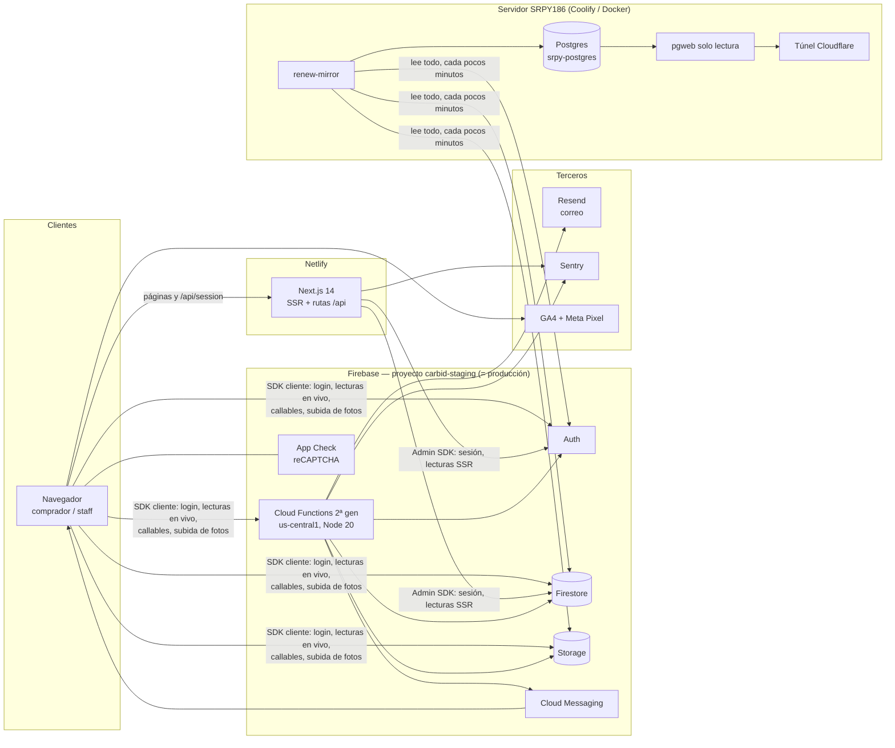
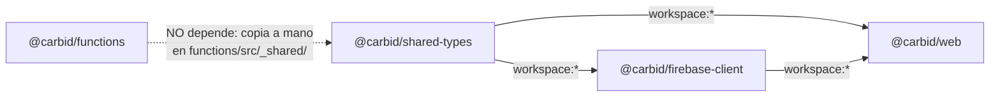
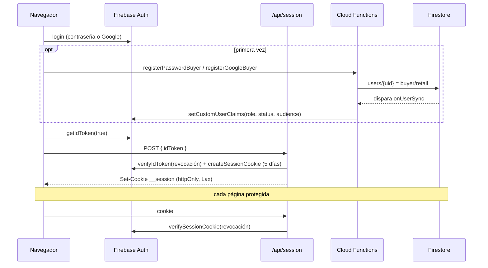
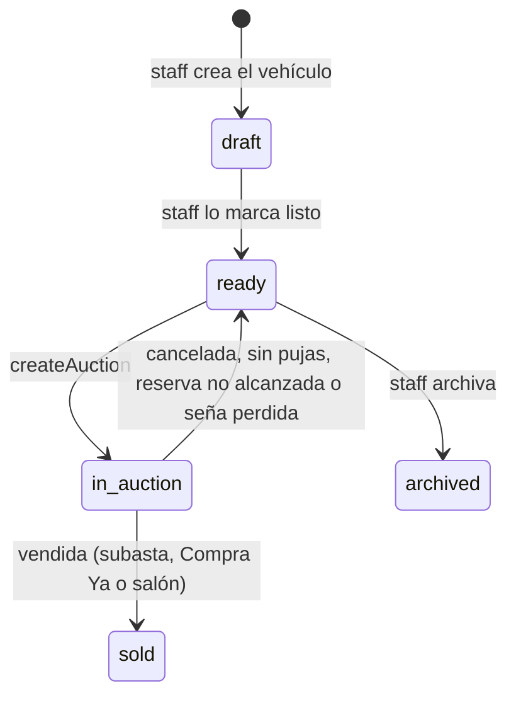
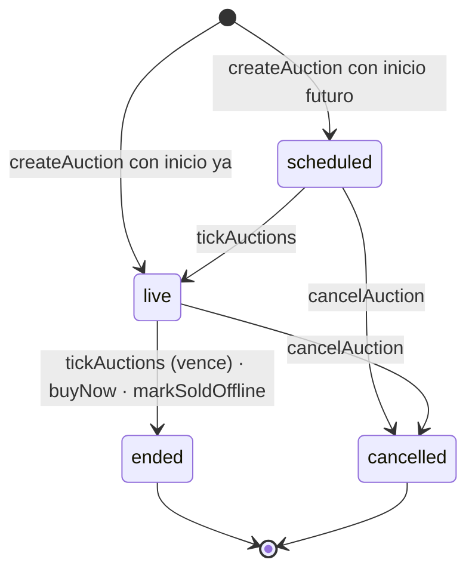

# Renew Subastas (CARBID) — Arquitectura

> **Estado: 26 de septiembre de 2026.** Documento canónico de cómo está armada la plataforma.
> Todo lo que dice acá se verificó contra el código de este repo y contra producción ese día.
> Si cambiás algo que este documento describe, actualizalo **en el mismo commit**.

**Para quién es:** cualquier desarrollador que tenga que tocar la app sin haber estado en su
construcción. Leé primero la sección 0 — son las cinco cosas que, si no las sabés, rompen
producción.

## Índice

0. [Antes de tocar nada](#0-antes-de-tocar-nada)
1. [Qué es y quién la usa](#1-qué-es-y-quién-la-usa)
2. [Mapa del sistema](#2-mapa-del-sistema)
3. [Estructura del repositorio](#3-estructura-del-repositorio)
4. [Tecnologías](#4-tecnologías)
5. [Modelo de datos](#5-modelo-de-datos)
6. [Autenticación y sesión](#6-autenticación-y-sesión)
7. [Autorización](#7-autorización)
8. [Flujos de negocio](#8-flujos-de-negocio)
9. [Inventario de Cloud Functions](#9-inventario-de-cloud-functions)
10. [Frontend](#10-frontend)
11. [Correo, notificaciones y push](#11-correo-notificaciones-y-push)
12. [Seguridad](#12-seguridad)
13. [Entornos, despliegue y CI](#13-entornos-despliegue-y-ci)
14. [Desarrollo local](#14-desarrollo-local)
15. [Pruebas](#15-pruebas)
16. [Operación](#16-operación)
17. [Trampas conocidas](#17-trampas-conocidas)
18. [Hacia dónde va](#18-hacia-dónde-va)

---

## 0. Antes de tocar nada

1. **No existe un entorno de pruebas en la nube.** El proyecto de Firebase se llama
   `carbid-staging`, pero **es producción** (nombre visible "RENEW Subastas"). Cualquier
   `firebase deploy --project carbid-staging` llega a compradores reales en segundos. El alias
   `production → carbid-59ef5` de `.firebaserc` es un proyecto viejo que **no usa nadie**.
2. **`git push origin main` despliega la web a producción.** Netlify está conectado al repo y
   publica cada push a `main` en ~2 minutos. Si el build falla, producción queda en el último
   deploy bueno: un commit en `main` **no garantiza** que esté publicado (ver §13).
3. **Las Cloud Functions, las reglas y los índices se despliegan aparte**, con el CLI de
   Firebase. Si un cambio toca reglas y web a la vez, desplegá en el orden que no deje a nadie
   afuera (§13).
4. **El Admin SDK se saltea las reglas de Firestore.** Toda lectura desde un server component o
   una función ignora `firestore.rules`; esas rutas tienen que repetir a mano los chequeos de
   rol y audiencia (§7).
5. **Paraguay es UTC-3 todo el año** (sin horario de verano desde 2024). El código de fechas lo
   asume en forma explícita y está duplicado a propósito entre `functions/` y `apps/web` (§17).

---

## 1. Qué es y quién la usa

**Renew Subastas** es la plataforma web de subastas de vehículos usados de Santa Rosa Paraguay
S.A., publicada en **https://renewsubastas.com.py**. El personal carga los vehículos con fotos;
los compradores pujan en subastas con fecha de cierre (o compran al instante con "Compra Ya");
el ganador paga una seña por transferencia y sube el comprobante; finanzas la confirma o la da
por perdida.

| Rol        | Quién                       | Qué puede hacer                                                                                                                               |
| ---------- | --------------------------- | --------------------------------------------------------------------------------------------------------------------------------------------- |
| `admin`    | Pocas personas de confianza | Todo: usuarios de cualquier rol, configuración global (incluye datos bancarios), auditoría, confirmar pagos                                   |
| `staff`    | Operaciones                 | Carga vehículos, crea y maneja subastas, da de alta compradores y staff, marca ventas en salón. No crea admins ni confirma pagos              |
| `finanzas` | Administración              | Libro de ventas: confirma o da por perdida la seña, ve el comprobante y el contacto del ganador. Solo lectura en lo demás                     |
| `buyer`    | Compradores                 | Divididos en dos **audiencias** que no se cruzan: `retail` (público) y `wholesale` (mayoristas). Cada uno ve solo el catálogo de su audiencia |

Los roles están definidos en `packages/shared-types/src/user.ts` (`RoleSchema`, `AudienceSchema`)
y viajan como _custom claims_ en el token de Firebase (§6).

**Otras superficies relacionadas:**

| URL                      | Qué es                                               | Dónde vive                                         |
| ------------------------ | ---------------------------------------------------- | -------------------------------------------------- |
| `renewsubastas.com.py`   | La app                                               | Netlify + Firebase                                 |
| `subastas.santarosa.lat` | Visor de solo lectura del espejo en Postgres (pgweb) | Servidor SRPY186, detrás de un túnel de Cloudflare |

---

## 2. Mapa del sistema



Tres ideas para leer el diagrama:

- **La lógica de negocio que mueve plata o estados vive en Cloud Functions** (pujar, comprar ya,
  cerrar subastas, confirmar pagos, dar roles). El frontend presenta y llama.
- **Hay dos formas de leer datos.** Las páginas se renderizan en el servidor leyendo Firestore
  con el Admin SDK (rápido, sin reglas). Lo que tiene que estar en vivo (pujas, campana de
  notificaciones) se lee desde el navegador con `onSnapshot`, bajo las reglas.
- **El espejo es de solo lectura y no afecta a la app.** Copia Firestore, Auth y el índice de
  Storage a Postgres en SRPY186 para tener los datos fuera de Firebase (§16).

---

## 3. Estructura del repositorio

Monorepo **pnpm** (`pnpm@9`) orquestado con **Turborepo**. Miembros (`pnpm-workspace.yaml`):
`apps/*`, `packages/*` y `functions`.

```
.
├── apps/
│   ├── web/                 # @carbid/web — toda la app Next.js (todos los roles, es/en)
│   └── mirror/              # @carbid/mirror — espejo Firestore/Auth/Storage → Postgres (SRPY186)
│       └── pgweb/           # visor web de solo lectura del espejo
├── functions/               # @carbid/functions — Cloud Functions (lógica de negocio)
│   ├── src/                 # auctions/ auth/ config/ insights/ notifications/ vehicles/ lib/ _shared/ security/
│   └── scripts/             # scripts de operación, seeds, E2E (§16)
├── packages/
│   ├── shared-types/        # @carbid/shared-types — esquemas Zod del dominio, validadores (CI/RUC, contraseña), financiación
│   └── firebase-client/     # @carbid/firebase-client — inicialización única del SDK web + emuladores
├── load-test/               # prueba de carga k6 de una subasta caliente
├── docs/                    # este documento, runbook, specs/plans, manuales, onboarding, seguridad
├── firestore.rules          # reglas de Firestore
├── firestore.indexes.json   # 29 índices compuestos + overrides
├── storage.rules            # reglas de Storage
├── firebase.json            # functions, reglas, emuladores (puertos)
├── netlify.toml             # build y cabeceras de la web
└── .github/workflows/pr.yml # único workflow de CI
```

### Dirección de dependencias



- `functions` **no** importa `@carbid/shared-types`: `functions/src/_shared/` es una **copia
  mantenida a mano** de los esquemas (`vehicle`, `bid`, `financing`, `app-config`, `user`,
  validadores). Si cambiás un esquema en `packages/shared-types`, cambialo también ahí.
- `apps/web` y `functions` tienen **cada uno su propia inicialización del Admin SDK**
  (`apps/web/src/lib/firebase/admin.ts` y `functions/src/lib/admin.ts`).
- `shared-types` se compila a `dist/` antes que la web (lo hace el comando de build de Netlify).

---

## 4. Tecnologías

Versiones exactas: en cada `package.json`. Resumen:

| Capa             | Tecnología                                                                                                                                                                                              |
| ---------------- | ------------------------------------------------------------------------------------------------------------------------------------------------------------------------------------------------------- |
| Web              | Next.js 14 (App Router, server components), React 18, TypeScript estricto, Tailwind 3.4, componentes estilo shadcn/ui sobre Radix, `next-intl` 3 (es/en), `next-themes`, `motion`, `recharts`, `sonner` |
| Formularios      | `react-hook-form` + Zod                                                                                                                                                                                 |
| Cliente Firebase | `firebase` 10 (Auth, Firestore, Storage, Functions, Messaging, App Check)                                                                                                                               |
| Servidor web     | `firebase-admin` 12 dentro de Next.js (rutas `/api` y server components)                                                                                                                                |
| Backend          | `firebase-functions` 5 (2ª gen), `firebase-admin` 12, Zod en cada entrada, `resend` para correo                                                                                                         |
| Observabilidad   | Sentry (`@sentry/nextjs` en la web, `@sentry/node` en functions)                                                                                                                                        |
| Analítica        | GA4 (`G-3DR82WVEKL`, solo páginas públicas) y Meta Pixel                                                                                                                                                |
| Herramientas     | pnpm 9, Turborepo 2, Node 20, ESLint, Prettier, Husky + lint-staged, Vitest 1.6                                                                                                                         |

Todos los paquetes son ESM (`"type": "module"`). El `tsconfig.base.json` es estricto
(`noUncheckedIndexedAccess`, `exactOptionalPropertyTypes`).

---

## 5. Modelo de datos

### Firestore

"Servidor" = solo el Admin SDK escribe (una función o una ruta de Next). "Cliente" = el
navegador escribe directo, bajo reglas.

| Colección                             | Qué guarda                                                                                                             | Quién escribe                                                                                                                   | Quién lee (reglas)                                                                                                    |
| ------------------------------------- | ---------------------------------------------------------------------------------------------------------------------- | ------------------------------------------------------------------------------------------------------------------------------- | --------------------------------------------------------------------------------------------------------------------- |
| `users/{uid}`                         | Perfil (`profile.*`, documento CI/RUC, audiencia), `role`, `status`, `preferences`, `favorites`, `fcmTokens`           | Servidor (altas, cambios de rol, registro). Cliente: **solo** `favorites`                                                       | El dueño; admin todo                                                                                                  |
| `vehicles/{id}`                       | Ficha del vehículo, fotos, `status`                                                                                    | Cliente: staff/admin crean y editan directo (no hay función de alta). Servidor: cambios de estado por subastas, `deleteVehicle` | Internos todo; comprador solo su audiencia                                                                            |
| `auctions/{id}`                       | Precio base, incremento, `buyNowPrice`, fechas, puja actual, resultado, estado de pago, `vehicleSnapshot`, `viewStats` | **Solo servidor**                                                                                                               | Internos todo; comprador solo su audiencia                                                                            |
| `auctions/{id}/bids/{bidId}`          | Cada puja (`winning`/`outbid`/…)                                                                                       | Solo servidor (transacción de `placeBid`)                                                                                       | Internos; comprador solo si la subasta es de su audiencia                                                             |
| `auctions/{id}/private/{docId}`       | `reservePrice` y otros montos que el comprador **no** debe ver                                                         | Solo servidor                                                                                                                   | admin, staff, finanzas                                                                                                |
| `auctions/{id}/viewers/{uid}`         | Quién vio la subasta y cuántas veces                                                                                   | Solo servidor (`logAuctionView`)                                                                                                | admin, staff                                                                                                          |
| `auctions/{id}/priceChanges/{id}`     | Historial de cambios de precio                                                                                         | Solo servidor (`updateAuction`)                                                                                                 | admin, staff                                                                                                          |
| `page_views/{id}`                     | Una visita por documento (tráfico anónimo)                                                                             | Solo servidor (`logPageView`)                                                                                                   | Nadie                                                                                                                 |
| `insights_traffic_daily/{YYYY-MM-DD}` | Resumen diario del tráfico                                                                                             | Solo servidor (`aggregateTraffic`)                                                                                              | admin, staff, finanzas                                                                                                |
| `app_config/global`                   | Moneda, reglas de puja, financiación, remitente de correos, **datos bancarios**, `security.mfaRequiredRoles`           | Solo servidor (`updateGlobalConfig`)                                                                                            | admin, staff, finanzas                                                                                                |
| `audit_logs/{id}`                     | Quién hizo qué, con antes/después                                                                                      | Solo servidor (toda callable que modifica)                                                                                      | admin                                                                                                                 |
| `notifications/{id}`                  | Resultado de cada correo enviado a un usuario                                                                          | Solo servidor                                                                                                                   | admin, staff                                                                                                          |
| `password_reset_requests/{id}`        | Pedidos de "olvidé mi contraseña" que un admin atiende a mano                                                          | Crea el servidor; admin gestiona                                                                                                | admin                                                                                                                 |
| `password_set_tokens/{id}`            | Tokens de un solo uso para fijar contraseña (id = SHA-256 del token)                                                   | Solo servidor                                                                                                                   | Nadie                                                                                                                 |
| `rate_limits/{key}`                   | Ventanas de límite de uso (`bids_{uid}`, `views_{uid}`, `pageview_{sesión}`, `pwreset_…`)                              | Solo servidor                                                                                                                   | Nadie. Los de visitas (`views_`, `pageview_`) llevan `expiresAt` y una política TTL los borra solos; los demás quedan |

Detalles que importan:

- **`reservePrice` no está en `auctions/{id}`** sino en `auctions/{id}/private/internal`:
  Firestore no tiene permisos por campo, y en el documento de la subasta cualquier comprador lo
  leía con su `onSnapshot`.
- **`buyNowPrice` sí es visible** (es el número del botón) y tiene que ser mayor que la reserva.
- `onUserSync` copia `role`, `status` y `profile.audience` de `users/{uid}` a los _custom claims_
  en cada escritura. Es la fuente de verdad de los permisos.
- Los estados posibles están en `packages/shared-types/src/`:
  - Vehículo: `draft → ready → in_auction → sold | archived`
  - Subasta: `scheduled → live → ended | cancelled`; resultado `sold | reserve_not_met | no_bids | sold_offline`
  - Puja: `valid | outbid | winning | rejected`

### Storage

| Ruta                                         | Lectura                      | Escritura                                                                                                |
| -------------------------------------------- | ---------------------------- | -------------------------------------------------------------------------------------------------------- |
| `vehicles/{vehicleId}/**`                    | Cualquier usuario con sesión | staff/admin, imágenes, ≤10 MB                                                                            |
| `payment-proofs/{auctionId}/{uid}/{archivo}` | staff, admin, finanzas       | Solo el comprador `{uid}`, **solo crear** (`resource == null`): un comprobante enviado no se puede pisar |

La audiencia **no** se controla en Storage para las fotos: se confía en que la app nunca muestra
un vehículo de la otra audiencia.

### El espejo en Postgres

`apps/mirror` copia todo a Postgres en SRPY186 (tabla `fs_documents` con el documento en
`jsonb`, `auth_users`, `storage_objects`, vistas `v_*` por colección). Nunca borra: marca
`deleted_at`. Detalle en `apps/mirror/README.md`.

---

## 6. Autenticación y sesión

Firebase Auth es el proveedor de identidad. **Lo que el servidor de Next.js confía es una
cookie de sesión**, no el token del navegador. Y el navegador además mantiene su propia sesión
del SDK para llamar funciones y leer en vivo. Son dos mitades que tienen que coincidir.

### Formas de entrar

| Camino                                                         | Qué pasa                                                                                                                                                                                                                                                                |
| -------------------------------------------------------------- | ----------------------------------------------------------------------------------------------------------------------------------------------------------------------------------------------------------------------------------------------------------------------- |
| Email + contraseña (comprador nuevo)                           | `/register` crea la cuenta en Auth → el comprador verifica el correo → al entrar, `registerPasswordBuyer` crea `users/{uid}` como `buyer`/`retail`. Exige `email_verified`. Las altas abandonadas sin verificar las borra `sweepUnverifiedAccounts` (08:00, a las 72 h) |
| Google (comprador)                                             | `signInWithPopup` → `registerGoogleBuyer` crea el comprador si no existe (nunca pisa una cuenta interna con el mismo correo)                                                                                                                                            |
| Invitación (staff, admin, finanzas o comprador cargado a mano) | `createUser` crea la cuenta y manda un enlace de un solo uso para fijar la contraseña (`password_set_tokens`)                                                                                                                                                           |

Rol y audiencia **siempre** los decide el servidor; el cliente no puede mandarlos.

### Crear la sesión — `POST /api/session`

`apps/web/src/app/api/session/route.ts`:

1. `sameOrigin()` (`lib/auth/same-origin.ts`): rechaza pedidos de otro dominio.
2. `verifyIdToken(idToken, true)` — `true` = también rechaza tokens revocados.
3. Rechaza si `status !== 'active'`.
4. **Segundo factor por rol** (`lib/auth/mfa-gate.ts`): si el rol está en
   `app_config/global.security.mfaRequiredRoles` y ese inicio de sesión no usó segundo factor,
   responde `403 mfa_required`. Hoy la lista está **vacía** (ver §12).
5. `createSessionCookie` por **5 días** (`SESSION_TTL_MS`).
6. Cookie `__session`: `httpOnly`, `secure` en producción, **`SameSite=Lax`**, `path=/`.
   (`Lax` y no `Strict`: con `Strict` quien entraba desde un enlace de WhatsApp, Instagram o
   Google llegaba sin sesión.)

`DELETE /api/session` la borra (cerrar sesión, sesión vencida).

### Leer la sesión en el servidor

`getCurrentUser(locale)` (`lib/auth/server.ts`, memorizada por request con `React.cache`):
sin cookie → `/login`; `verifySessionCookie(cookie, true)`; cuenta deshabilitada →
`?error=disabled`; sin rol → `?error=no_role`; credencial inválida → `?error=expired` (el login
borra la cookie); **falla de red al verificar** → `?error=temporary` (el login **no** borra la
cookie, para no convertir un corte de red en un cierre de sesión). `requireRole(locale, roles)`
encima de eso.

### El puente de sesión (desde el 26/9/2026)

Las callables (`placeBid`, `buyNow`, `savePushToken`…) viajan con el token del **SDK del
navegador**, no con la cookie. En iPhone, una web agregada a la pantalla de inicio arranca con
la cookie pero con el almacenamiento vacío: la página protegida se ve bien y cada llamada vuelve
`401`. Para eso:

- `POST /api/session/client-token` canjea la cookie (verificada con revocación) por un _custom
  token_ (`lib/auth/client-token.ts`).
- `ensureClientAuth(uid)` (`lib/auth/ensure-client-auth.ts`) entra con ese token solo si el
  navegador no tiene al usuario de la cookie. Si ya lo tiene, no hace ninguna llamada.
- `<SessionBridge>` lo ejecuta al montar cualquier página protegida, y `enablePush` lo pide
  antes de guardar el token de push.

El token resultante trae los mismos claims (`role`, `status`), así que reglas y funciones ven
exactamente lo mismo.

### Ciclo de vida de los claims



Cuando `updateUserRole` cambia rol, estado o audiencia, **revoca los tokens** del usuario: la
próxima página falla la verificación y obliga a entrar de nuevo con los claims nuevos.
`redeemPasswordReset`, `deleteUser`, `hardDeleteUser` y `revokeMySessions` también revocan.

### Contraseñas

Una sola regla — **10 caracteres, una minúscula y un número** — aplicada en tres capas: la
política del proyecto de Firebase Auth (modo `ENFORCE`, cubre todo lo que el navegador hace con
el SDK), `PasswordSchema` en `packages/shared-types/src/validators/password.ts` (formularios, con
el mensaje en español), y una **copia explícita** en `functions/src/auth/redeemPasswordReset.ts`,
porque el Admin SDK se saltea la política del proyecto.

---

## 7. Autorización

Tres capas independientes. Ninguna alcanza sola:

| Capa         | Mecanismo                                                                                                                                               | Ejemplo                                                               |
| ------------ | ------------------------------------------------------------------------------------------------------------------------------------------------------- | --------------------------------------------------------------------- |
| 1. Reglas    | `firestore.rules`, `storage.rules`. Única barrera de las escrituras directas del cliente (vehículos, `favorites`) y de todas las lecturas del navegador | `allow create, update: if isStaff() \|\| isAdmin();` en `vehicles`    |
| 2. Funciones | `requireSignedIn` / `requireAdmin` (`functions/src/lib/errors.ts`) + chequeos de rol en cada handler                                                    | `placeBid` y `buyNow` rechazan a quien no es `buyer`                  |
| 3. Next.js   | `requireRole()` en los `layout.tsx` de cada grupo, y chequeos a mano en los _loaders_ que leen con el Admin SDK                                         | `auctions/[id]/page.tsx` repite el chequeo de audiencia de las reglas |

Guardas de ruta (`apps/web/src/app/[locale]/(protected)/`):

| Layout                  | Roles                                                                    |
| ----------------------- | ------------------------------------------------------------------------ |
| `admin/`                | admin                                                                    |
| `staff/`                | admin, staff, finanzas (las páginas de alta/edición excluyen a finanzas) |
| `staff/insights/`       | admin, staff                                                             |
| `sales/`                | admin, finanzas                                                          |
| `[audience]/`           | cualquiera con sesión; un comprador es redirigido a **su** audiencia     |
| `settings/danger-zone/` | buyer (baja de la propia cuenta)                                         |

### Matriz de capacidades

| Acción                                      | admin                                      | staff            | finanzas | buyer              |
| ------------------------------------------- | ------------------------------------------ | ---------------- | -------- | ------------------ |
| Crear usuarios                              | ✅ cualquier rol                           | ✅ buyer y staff | ❌       | ❌                 |
| Cambiar rol / estado / audiencia            | ✅                                         | ❌               | ❌       | ❌                 |
| Dar de baja una cuenta                      | ✅ (no admins)                             | ❌               | ❌       | ✅ solo la propia  |
| Borrado definitivo                          | ✅ (deshabilitada, no admin, no uno mismo) | ❌               | ❌       | ❌                 |
| Generar enlace de contraseña para otro      | ✅                                         | ❌               | ❌       | ❌                 |
| Cerrar mis sesiones en todos lados          | ✅                                         | ✅               | ✅       | ✅                 |
| Crear / editar vehículos                    | ✅                                         | ✅               | ❌       | ❌                 |
| Borrar vehículo                             | ✅                                         | ✅               | ❌       | ❌                 |
| Crear / editar / cancelar / borrar subastas | ✅                                         | ✅               | ❌       | ❌                 |
| Marcar vendido en salón (`markSoldOffline`) | ✅                                         | ✅               | ❌       | ❌                 |
| Pujar / Compra Ya                           | ❌ (evita pujas propias)                   | ❌               | ❌       | ✅ su audiencia    |
| Ver contacto de postores                    | ✅                                         | ✅               | ❌       | ❌                 |
| Ver contacto del ganador                    | ✅                                         | ❌               | ✅       | ❌                 |
| Confirmar o dar por perdida la seña         | ✅                                         | ❌               | ✅       | ❌                 |
| Subir comprobante de pago                   | ❌                                         | ❌               | ❌       | ✅ solo el ganador |
| Editar configuración global                 | ✅                                         | ❌               | ❌       | ❌                 |
| Ver auditoría                               | ✅                                         | ❌               | ❌       | ❌                 |
| Ver reportes (`/staff/insights`)            | ✅                                         | ✅               | ❌       | ❌                 |

---

## 8. Flujos de negocio

### Ciclo de vida de vehículo y subasta





`tickAuctions` corre **cada minuto** con tres pasadas independientes (si una subasta falla, no
frena a las demás): promueve `scheduled → live`; cierra `live → ended` calculando el resultado
dentro de una transacción (si es `sold`, fija `paymentStatus=pending_payment`, la seña según
`app_config.payment.depositPercent` y el plazo según `deadlineHours`); y da por perdidas las
señas vencidas (`pending_payment → forfeited`, vehículo a `ready`).

### Pujar — `placeBid`

1. Solo `buyer`, con perfil completo (tipo y número de documento); si no, `profile_incomplete`.
2. Monto validado con Zod, tope `app_config.bid.maxBidUsd`, redondeado a centavos.
3. En una sola transacción: límite de **10 pujas por minuto** por comprador; la subasta tiene que
   estar `live`, ser de su audiencia y no haber vencido; no puede superarse a sí mismo.
4. **Mínimo:** la primera puja tiene que superar el precio base en `max(incremento, USD 500)`;
   las siguientes, la puja actual más el incremento.
5. **Anti-sniping:** si falta menos de `antiSnipingSeconds` (60 s por defecto), extiende el cierre.
6. Marca la puja anterior como `outbid` y escribe la nueva como `winning`.
7. La puja nueva dispara `sendBidOutbid`, que avisa por correo al que quedó superado.

Firestore aguanta ~1 escritura por segundo sostenida por documento: una subasta muy disputada
es un documento caliente. La prueba de carga está en `load-test/` (§15).

### Compra Ya — `buyNow`

Compra directa a `buyNowPrice`. Produce **exactamente la misma transición** que un cierre por
vencimiento (`ended`, `sold`, `winnerUid`), así que el correo de ganador, la página de ganadas,
el comprobante y el barrido de vencimiento funcionan igual. El botón desaparece con la primera
puja, y el servidor lo revalida. El cliente manda el precio que vio (`expectedPrice`): si un
staff lo cambió en el medio, la compra se rechaza.

### Venta en salón — `markSoldOffline`

staff/admin marcan una unidad como vendida fuera de la plataforma. Resultado `sold_offline`:
**no entra en el GMV** (no hubo puja, seña ni comprobante). `sendAuctionSoldOffline` avisa a los
postores que tenía la subasta.

### Ganar y pagar

```
subasta cerrada como vendida (vencimiento o Compra Ya)
  → sendAuctionWon: correo al ganador con datos bancarios, monto de seña y plazo
  → sendAuctionSoldInternal: aviso interno de la venta
  → el comprador sube el comprobante a payment-proofs/{auctionId}/{uid}/{archivo}
  → submitPaymentProof: verifica que sea el ganador y que siga pendiente, guarda la ruta
    y manda a administración el legajo completo con el comprobante adjunto
  → admin o finanzas: confirmAuctionPayment(paid | forfeited)
       paid → correo de confirmación al comprador y aviso de facturación
       forfeited → vehículo vuelve a ready
  → si nadie confirma: tickAuctions la da por perdida al vencer el plazo
```

### Reportes y tráfico

| Qué                  | Cómo                                                                                                                                                                            |
| -------------------- | ------------------------------------------------------------------------------------------------------------------------------------------------------------------------------- |
| Visitas a subastas   | `ViewTracker` en la ficha → `logAuctionView` (solo compradores, 1 cada 30 min por pestaña) → `auctions/{id}/viewers` y `viewStats`                                              |
| Tráfico del sitio    | `logPageView` (anónimo, sin login; descarta bots y rutas con credenciales) → `page_views` → `aggregateTraffic` (09:30 hora PY) → `insights_traffic_daily`                       |
| Reportes             | `/staff/insights`: lectura directa con Admin SDK. Incluye el **comparador de períodos** (`lib/insights/period-compare.ts`): 13 métricas, rangos por fecha, sin JS en el cliente |
| Vehículos sin vender | `dailyUnsoldDigest` (09:00 hora PY): correo a admin/staff con lo que lleva ≥7 días publicado                                                                                    |
| Historial de precios | `updateAuction` guarda cada cambio en `priceChanges`                                                                                                                            |

---

## 9. Inventario de Cloud Functions

**37 funciones** exportadas en `functions/src/index.ts`, todas en `us-central1`: 27 callables,
6 disparadores de Firestore y 4 programadas. **25 de las 27 callables exigen App Check**
(`enforceAppCheck: process.env['ENFORCE_APP_CHECK'] !== 'false'`); las dos que no son
`pingHealth` y `requestPasswordReset`. A propósito no piden usuario: `pingHealth`,
`requestPasswordReset`, `redeemPasswordReset` y `logPageView`. Piden usuario de Firebase pero
todavía sin rol: `registerGoogleBuyer` y `registerPasswordBuyer`.

### Auth y usuarios (12)

| Función                   | Tipo                  | Para qué                                                                            |
| ------------------------- | --------------------- | ----------------------------------------------------------------------------------- |
| `createUser`              | callable              | Alta de usuario por admin/staff; manda enlace para fijar contraseña                 |
| `updateUserRole`          | callable              | Cambio de rol/estado/audiencia (admin); protege al último admin; revoca sesiones    |
| `deleteUser`              | callable              | Baja lógica (admin a otros, comprador a sí mismo)                                   |
| `hardDeleteUser`          | callable              | Borrado definitivo de una cuenta ya deshabilitada (admin)                           |
| `onUserSync`              | `users/{uid}` escrito | Copia rol/estado/audiencia a los custom claims                                      |
| `generatePasswordReset`   | callable              | Admin genera y envía un enlace de contraseña (dice si el correo salió de verdad)    |
| `redeemPasswordReset`     | callable, sin sesión  | Canjea el token, fija la contraseña (regla de 10/minúscula/número), revoca sesiones |
| `requestPasswordReset`    | callable, sin sesión  | Pedido de reseteo (3 por hora por correo) para que un admin lo atienda              |
| `revokeMySessions`        | callable              | "Cerrar sesión en todos lados"                                                      |
| `registerGoogleBuyer`     | callable              | Alta de comprador con Google                                                        |
| `registerPasswordBuyer`   | callable              | Alta de comprador con email verificado                                              |
| `sweepUnverifiedAccounts` | programada 08:00 PY   | Borra altas sin verificar de más de 72 h                                            |

### Subastas y vehículos (12)

| Función                 | Tipo                   | Para qué                                                                                          |
| ----------------------- | ---------------------- | ------------------------------------------------------------------------------------------------- |
| `createAuction`         | callable               | Crea la subasta desde un vehículo `ready`                                                         |
| `updateAuction`         | callable               | Edita (completa si está programada; en vivo solo extender el cierre) y registra cambios de precio |
| `cancelAuction`         | callable               | Cancela y libera el vehículo                                                                      |
| `deleteAuction`         | callable               | Borra subastas programadas, canceladas o terminadas sin ganador                                   |
| `placeBid`              | callable               | Pujar (§8)                                                                                        |
| `buyNow`                | callable               | Compra Ya (§8)                                                                                    |
| `markSoldOffline`       | callable               | Vendido en salón (§8)                                                                             |
| `tickAuctions`          | programada cada minuto | Abre, cierra y barre señas vencidas                                                               |
| `confirmAuctionPayment` | callable               | Seña pagada o perdida (admin/finanzas)                                                            |
| `submitPaymentProof`    | callable               | Registro del comprobante del ganador                                                              |
| `getWinnerContact`      | callable               | Contacto del ganador (admin/finanzas)                                                             |
| `resolveBidders`        | callable               | Contactos de hasta 50 postores para el panel de pujas                                             |
| `deleteVehicle`         | callable               | Borra vehículo y fotos (no si está en subasta o vendido)                                          |

### Notificaciones (6)

| Función                   | Tipo                | Para qué                                                       |
| ------------------------- | ------------------- | -------------------------------------------------------------- |
| `sendBidOutbid`           | puja creada         | Correo "te superaron"                                          |
| `sendAuctionWon`          | subasta actualizada | Correo al ganador al pasar a vendida                           |
| `sendAuctionSoldInternal` | subasta actualizada | Aviso interno de venta                                         |
| `sendAuctionSoldOffline`  | subasta actualizada | Aviso a postores cuando se vendió en salón                     |
| `sendAuctionLive`         | subasta escrita     | Push a los compradores de la audiencia cuando una subasta abre |
| `savePushToken`           | callable            | Guarda el token de push del dispositivo (máx. 10 por usuario)  |

### Reportes, configuración y salud (6)

| Función              | Tipo                 | Para qué                                      |
| -------------------- | -------------------- | --------------------------------------------- |
| `logAuctionView`     | callable             | Registro de visitas de compradores a subastas |
| `logPageView`        | callable, sin sesión | Registro anónimo de visitas al sitio          |
| `aggregateTraffic`   | programada 09:30 PY  | Resumen diario de tráfico                     |
| `dailyUnsoldDigest`  | programada 09:00 PY  | Correo de vehículos sin vender                |
| `updateGlobalConfig` | callable             | Edita `app_config/global` (admin)             |
| `pingHealth`         | callable, sin sesión | Chequeo de vida                               |

---

## 10. Frontend

`apps/web/src/app` es un árbol **App Router** con idioma en la URL (`next-intl`, `es` por
defecto, también `en`; textos en `apps/web/messages/{es,en}.json`).

```
app/
├── api/
│   ├── session/route.ts                 # POST crea la cookie, DELETE la borra (§6)
│   ├── session/client-token/route.ts    # puente de sesión (§6)
│   └── admin/users/export/route.ts      # exportación de usuarios a Excel/PDF
└── [locale]/
    ├── page.tsx                         # portada pública
    ├── (legal)/                         # términos, privacidad, cookies
    ├── (auth)/                          # login, register, auth/action, auth/set-password, auth/mfa/enroll
    └── (protected)/                     # layout con <AppShell> (barra, menú, campana, puente de sesión)
        ├── admin/                       # usuarios, auditoría, configuración, pedidos de contraseña
        ├── staff/                       # vehículos, subastas, compradores, pujas, reportes
        ├── sales/                       # libro de ventas (admin, finanzas)
        ├── auctions/, auctions/[id]/    # catálogo y ficha con panel de puja, Compra Ya, financiación
        ├── [audience]/                  # inicio del comprador (retail|wholesale), mis pujas, ganadas
        └── settings/                    # perfil, seguridad (MFA, sesiones), preferencias, baja
```

- `middleware.ts` resuelve el idioma; **no toca `/api`**.
- `(protected)/layout.tsx` monta `<AppShell>` (`components/shell/app-shell.tsx`), que llama a
  `getCurrentUser()`. La restricción por rol está un nivel más abajo, en el `layout.tsx` de cada
  grupo (§7).

| Carpeta                                                                                        | Contenido                                                                   |
| ---------------------------------------------------------------------------------------------- | --------------------------------------------------------------------------- |
| `src/lib/auth/`                                                                                | Sesión en servidor, creación y puente de sesión, MFA, `same-origin`         |
| `src/lib/firebase/`                                                                            | Cliente (`client.ts`), Admin (`admin.ts`), App Check, push (`messaging.ts`) |
| `src/lib/{admin,staff,buyer,auctions,insights,settings,export}/`                               | _Loaders_ de servidor (`server-only`) con Admin SDK, uno por pantalla       |
| `src/lib/analytics/`                                                                           | GA4, Meta Pixel y eventos, sesión de tráfico                                |
| `src/lib/observability/`                                                                       | Limpieza de datos personales antes de mandar a Sentry                       |
| `src/lib/{format,geo,legal,seo}/`                                                              | Formatos de Paraguay, datos legales de la empresa, SEO                      |
| `src/components/ui/`                                                                           | Primitivas (botón, diálogo, tabla, formulario…) sobre Radix                 |
| `src/components/shell/`                                                                        | Barra superior, menú lateral, campana, aviso de push, puente de sesión      |
| `src/components/{auctions,auth,brand,forms,insights,legal,motion,public,seo,theme,analytics}/` | Componentes por dominio                                                     |

**Diseño:** Tailwind con tokens semánticos (`bg-base`, `bg-elev`, `text-strong`, `text-muted`,
`text-subtle`…) definidos en `globals.css` y `tailwind.config`, modo claro/oscuro con
`next-themes`. `functions/src/lib/email-templates.ts` es la referencia de diseño de los correos.

**En vivo:** la campana (`notification-bell.tsx`) y la ficha de subasta usan `onSnapshot` bajo
las reglas. Las acciones van por `httpsCallable(fb.functions, '<nombre>')`.

---

## 11. Correo, notificaciones y push

### Correo — Resend

`functions/src/lib/email.ts` envuelve Resend en `sendEmail()`. La clave es el secreto
`RESEND_API_KEY` (Secret Manager). **`sendEmail` nunca lanza**: devuelve
`{ status: 'sent' | 'failed' | 'skipped', reason? }`. Siempre mirá `status` — tratar "no lanzó"
como "salió" fue un bug real (§17). Cada envío con destinatario registra el resultado en
`notifications`.

### Push web — FCM

1. `<PushPermissionPrompt>` (solo compradores) ofrece activar.
2. `enablePush()` (`lib/firebase/messaging.ts`): pide permiso, registra
   `/firebase-messaging-sw.js`, obtiene el token con la clave VAPID
   (`NEXT_PUBLIC_FIREBASE_VAPID_KEY`), asegura la sesión del cliente y llama a `savePushToken`.
   Devuelve el motivo exacto si falla (`unsupported`, `denied`, `dismissed`, `session`,
   `failed`); `failed` va a Sentry con el paso.
3. `sendAuctionLive` manda la notificación cuando una subasta abre, a los compradores de esa
   audiencia con la preferencia activada, y limpia tokens inválidos.

En iPhone, el push web **solo funciona si la web está agregada a la pantalla de inicio**. Hoy el
sitio no publica un `manifest`, así que depende del comportamiento de cada versión de iOS.

### Campana en la app

Lecturas en vivo: compradores ven subastas nuevas de su audiencia y sus victorias; internos ven
todas las pujas (`collectionGroup('bids')`); admin además los pedidos de contraseña. "Leído" se
guarda en `localStorage`.

---

## 12. Seguridad

Informe completo de la última auditoría: `docs/seguridad/informe-pruebas-2026-09-15.md`.

| Control                       | Estado                                                                                                                                                                                                                  |
| ----------------------------- | ----------------------------------------------------------------------------------------------------------------------------------------------------------------------------------------------------------------------- |
| Reglas de Firestore y Storage | Probadas con ataques ejecutables (`functions/src/security/*.pentest.test.ts`)                                                                                                                                           |
| App Check                     | **Forzado** en Firestore y Storage; callables con `enforceAppCheck`. Auth no forzado (quien no pase reCAPTCHA no podría ni entrar). Script: `functions/scripts/appcheck-enforcement.mjs`                                |
| Contraseñas                   | 10 caracteres, minúscula y número, en las tres capas de §6                                                                                                                                                              |
| Segundo factor (TOTP)         | Construido y desplegado, **exigencia apagada**. Requiere pasar el proyecto a Identity Platform (irreversible, sin costo con el volumen actual). Scripts: `auth-mfa-config.mjs`, `mfa-enforce.mjs`, `mfa-unenroll.mjs`   |
| Cabeceras HTTP                | Páginas (desde `next.config.mjs`): `X-Frame-Options: DENY`, `frame-ancestors 'none'`, HSTS con subdominios, `nosniff`, `Referrer-Policy`, `Permissions-Policy`. Archivos estáticos (desde `netlify.toml`): CSP completa |
| Límites de uso                | Pujas 10/min, visitas, reseteos de contraseña, visitas anónimas; contadores con TTL                                                                                                                                     |
| Auditoría                     | `audit_logs` en cada callable que modifica                                                                                                                                                                              |
| Montos ocultos                | `reservePrice` en un subdocumento que el comprador no puede leer                                                                                                                                                        |
| Datos bancarios               | `app_config/global` legible solo por internos                                                                                                                                                                           |
| Secretos                      | `RESEND_API_KEY` en Secret Manager; variables de Netlify para la web (§13). Nunca en el repo                                                                                                                            |

Pendientes conocidos: CSP completa en las páginas (necesita _nonces_), activar MFA para roles
internos, actualizaciones mayores de dependencias (Next 15, `firebase` 12, `next-intl` 4,
`firebase-admin` 13).

---

## 13. Entornos, despliegue y CI

| Entorno    | Web                                           | Firebase                                                                      |
| ---------- | --------------------------------------------- | ----------------------------------------------------------------------------- |
| Local      | `next dev`                                    | Emuladores (Auth 9099, Firestore 8080, Functions 5002, Storage 9199, UI 4000) |
| Producción | Netlify, sitio `renewsubastas` (`5ecfa35d-…`) | Proyecto `carbid-staging`                                                     |

### Web

- Automático: **push a `main`** → Netlify ejecuta
  `pnpm install --frozen-lockfile && pnpm --filter @carbid/shared-types build && pnpm --filter @carbid/web build`
  con `@netlify/plugin-nextjs`.
- Manual (para publicar una rama sin mergear):
  `npx -y netlify deploy --build --prod --filter @carbid/web --site 5ecfa35d-a428-452f-9c48-115a0b257114`
- **Qué está publicado de verdad:** mirá el `published_deploy.commit_ref` del sitio en la API de
  Netlify, no `git log`. Un build que falla deja producción en el anterior.
- Variables en Netlify: `NEXT_PUBLIC_FIREBASE_*` (incluida `VAPID_KEY`),
  `NEXT_PUBLIC_RECAPTCHA_SITE_KEY`, `NEXT_PUBLIC_SENTRY_DSN`, `NEXT_PUBLIC_USE_FIREBASE_EMULATORS=false`,
  y para el Admin SDK del servidor `FIREBASE_CLIENT_EMAIL` + `FIREBASE_PRIVATE_KEY`.
- `vercel.json` es un resto de una etapa anterior: producción **no** sale de Vercel.

### Firebase

```bash
firebase deploy --only functions:<nombre> --project carbid-staging    # una función
firebase deploy --only firestore:rules,storage --project carbid-staging
firebase deploy --only firestore:indexes --project carbid-staging
```

El `predeploy` compila las funciones. Si un cambio de **reglas** depende de un cambio de
**web** (o al revés), desplegá primero lo que acepta ambos mundos, para que en ningún momento
producción tenga reglas que rechacen al cliente publicado.

### CI

Un solo workflow: `.github/workflows/pr.yml` (en cada PR y push a `main`). Instala, compila
`shared-types`, lint, typecheck, tests sin emuladores (`shared-types`, `web`), tests de
`functions` con emuladores de Auth, Firestore y Storage, build de la web y chequeo de formato.
**No despliega nada.** (Estuvo en rojo del 15 al 26 de septiembre porque faltaba el emulador de
Storage.)

Reparto de trabajo: Pablo empuja a GitHub; el deploy lo controla Croman.

---

## 14. Desarrollo local

Requisitos: Node 20, pnpm 9, Java (para los emuladores) y el CLI de Firebase.

```bash
pnpm install
pnpm emulators        # Auth, Firestore, Functions y Storage, con datos en .emulator-data/
pnpm seed             # crea un admin en el emulador
pnpm seed:demo        # vehículos y subastas de ejemplo
pnpm dev:web          # Next en http://localhost:3100 apuntando a los emuladores
```

- `apps/web/.env.local` (no se commitea) con `NEXT_PUBLIC_USE_FIREBASE_EMULATORS=true`.
- Con los emuladores, **arrancá las funciones con `ENFORCE_APP_CHECK=false`**: si no, toda
  callable devuelve `401` porque en local no hay App Check.
- Correr `pnpm --filter @carbid/web build` pisa `apps/web/.next` y rompe un `next dev` que esté
  usando esa carpeta: pará el dev server, borrá `.next`, arrancá de nuevo.

---

## 15. Pruebas

| Qué                         | Dónde                                                                                              | Cómo se corre                                                                                                        |
| --------------------------- | -------------------------------------------------------------------------------------------------- | -------------------------------------------------------------------------------------------------------------------- |
| Unitarias de la web         | `apps/web/src/**/*.test.ts(x)` (~300)                                                              | `pnpm --filter @carbid/web test`                                                                                     |
| Esquemas y validadores      | `packages/shared-types/src/**/*.test.ts`                                                           | `pnpm --filter @carbid/shared-types test`                                                                            |
| Funciones contra emuladores | `functions/src/**/*.test.ts` (~380)                                                                | `firebase emulators:exec --only auth,firestore,storage --project carbid-test 'pnpm --filter @carbid/functions test'` |
| Ataques a las reglas        | `functions/src/security/firestore-rules.pentest.test.ts`, `storage-rules.pentest.test.ts`          | Incluidas en la fila anterior                                                                                        |
| Recorrido completo          | `functions/scripts/e2e-flow.ts`                                                                    | Contra emuladores                                                                                                    |
| Carga                       | `load-test/hot-auction-bids.js` (k6) + `functions/scripts/verify-load-auction.mjs` (8 invariantes) | Contra emuladores o un proyecto descartable. **Nunca contra producción**                                             |
| Circuito en producción      | `functions/scripts/circuit-test.mjs`                                                               | Aborta salvo `I_KNOW_THIS_WRITES_TO_PRODUCTION=1`                                                                    |

Los tests de funciones usan el proyecto `carbid-test` del emulador, así no borran los datos de
desarrollo de `carbid-staging`.

---

## 16. Operación

### Dónde mirar cuando algo falla

| Síntoma                      | Dónde                                                                                            |
| ---------------------------- | ------------------------------------------------------------------------------------------------ |
| Error en la web              | Sentry (proyecto web)                                                                            |
| Error en una función         | Cloud Logging, filtrando `resource.labels.service_name="<nombre en minúsculas>"`; también Sentry |
| "No le llegó el correo"      | `notifications/{id}` (status y motivo) y el panel de Resend                                      |
| ¿Qué versión está publicada? | API de Netlify, `published_deploy`                                                               |

### Scripts de operación (`functions/scripts/`)

Los que tocan producción usan la sesión de `firebase login` de la máquina (dueño del proyecto),
no la clave del Admin SDK: **esa clave no es dueña del proyecto** y recibe 403 en App Check, IAM
y TTL. Los de prueba y demo apuntan a los emuladores.

| Script                                                                                                                              | Para qué                                                                 |
| ----------------------------------------------------------------------------------------------------------------------------------- | ------------------------------------------------------------------------ |
| `appcheck-enforcement.mjs`                                                                                                          | Ver o cambiar el modo de App Check por servicio (con rollback)           |
| `auth-password-policy.mjs`                                                                                                          | Ver o aplicar la política de contraseña de Firebase Auth                 |
| `auth-mfa-config.mjs`, `mfa-enforce.mjs`, `mfa-unenroll.mjs`                                                                        | Configurar MFA, exigirlo por rol, quitar factores (salida de emergencia) |
| `bootstrap-admin.ts`                                                                                                                | Crear el primer admin                                                    |
| `refresh-claims.mjs`                                                                                                                | Reescribir cada usuario para que `onUserSync` rehaga los claims          |
| `send-test-emails.mjs`                                                                                                              | Renderizar todos los correos con datos reales de configuración           |
| `e2e-flow.ts`, `e2e-ui-setup.ts`, `close-as-sold.ts`, `seed-demo*.ts`                                                               | Pruebas y demos contra emuladores                                        |
| `mint-load-tokens.ts`, `verify-load-auction.mjs`                                                                                    | Prueba de carga                                                          |
| `circuit-test.mjs`                                                                                                                  | Circuito completo en producción (protegido)                              |
| `migrate-*`, `backfill-*`, `snap-bids-to-cents.mjs`, `clean-long-names.mjs`, `fix-corrupt-auctions.mjs`, `reactivate-auth-user.mjs` | Arreglos de datos de una sola vez (históricos)                           |

### Espejo y visor (SRPY186)

- `renew-mirror` (Docker): copia Firestore, Auth y el índice de Storage a Postgres con una
  cuenta de servicio de **solo lectura**. `/healthz` informa la fase. Deploy:
  `apps/mirror/deploy-to-srpy186.sh`.
- pgweb (`apps/mirror/pgweb/`): visor de solo lectura con el rol `renew_mirror_ro`, sin puertos
  expuestos, publicado por el túnel `cloudflared-compras` en `subastas.santarosa.lat`. Tiene
  contraseña básica hasta que Cloudflare Access cubra ese nombre (hoy responde 401 del origen,
  no la redirección de Access).

---

## 17. Trampas conocidas

Cada una ya costó un bug o una tarde. Están acá para que no se repitan.

| Trampa                                            | Qué pasa                                                                                  | Qué hacer                                                                           |
| ------------------------------------------------- | ----------------------------------------------------------------------------------------- | ----------------------------------------------------------------------------------- |
| `FieldValue.serverTimestamp()` dentro de un array | Firestore rechaza la escritura entera                                                     | Usar `Timestamp.now()` en elementos de arrays (así se rompió el push hasta el 26/9) |
| Admin SDK                                         | Se saltea reglas **y** la política de contraseñas                                         | Repetir chequeos a mano donde se use                                                |
| `sendEmail()`                                     | Nunca lanza                                                                               | Mirar `status`, nunca asumir que salió                                              |
| Documento caliente                                | ~1 escritura/s sostenida por documento                                                    | Tenerlo en cuenta en subastas muy disputadas                                        |
| Hora de Paraguay                                  | UTC-3 fijo, duplicado en `functions/` y `apps/web` a propósito (son workspaces separados) | Si vuelve el horario de verano, cambiar ambos                                       |
| Claves de fecha `YYYY-MM-DD`                      | Se ordenan igual como texto que como calendario                                           | Consultas de rango por un solo campo, sin índice compuesto                          |
| Sesión partida en iPhone                          | Cookie viva, SDK del navegador vacío → 401 en callables                                   | Resuelto con el puente de sesión (§6); no quitarlo                                  |
| Clave del Admin SDK                               | No es dueña del proyecto: 403 en IAM, App Check, TTL                                      | Usar la sesión de `firebase login`                                                  |
| App Check en emuladores                           | Callables devuelven 401                                                                   | `ENFORCE_APP_CHECK=false`                                                           |
| Worktrees y vista previa                          | La vista previa del escritorio sirve el checkout principal, no el worktree                | Verificar con scripts contra emuladores o desde el checkout correcto                |
| lint-staged                                       | Usa `git stash` internamente                                                              | No tener stashes propios colgando al commitear                                      |
| `docker exec -i` dentro de `ssh … bash -s`        | Se come el resto del script                                                               | Sin `-i` y con `</dev/null`                                                         |

---

## 18. Hacia dónde va

- **Migrar fuera de Firebase** a infraestructura propia (Coolify + Supabase en SRPY186), con la
  web como app instalable y, más adelante, apps nativas. El espejo en Postgres es el primer paso
  (los datos ya viven también en el servidor). El diseño de la migración va en
  `docs/superpowers/specs/`.
- Pendientes de seguridad de §12.
- Publicar un `manifest` para que la web se pueda instalar y el push funcione en todos los iPhone.

Especificaciones de cada funcionalidad: `docs/superpowers/specs/` (diseño) y
`docs/superpowers/plans/` (plan de implementación). Operación diaria: `docs/PRODUCTION_RUNBOOK.md`
(del 25/6, parcialmente desactualizado: la sección de despliegue de este documento manda).
