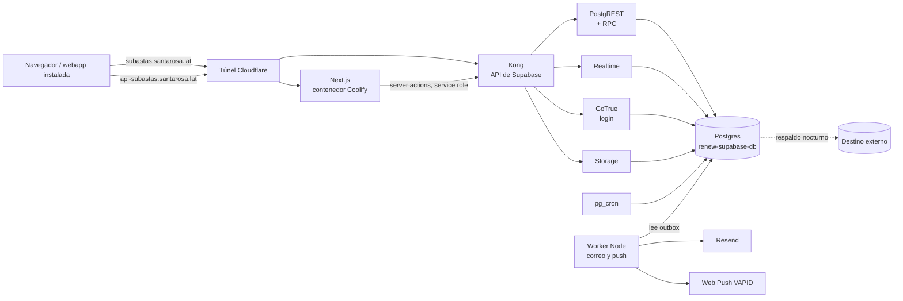

# Renew Subastas en servidor propio (Coolify + Supabase) — Diseño

- **Fecha:** 26 de septiembre de 2026
- **Estado:** aprobado por Croman el 26/9 (decisiones en §2)
- **Arquitectura actual:** `docs/ARQUITECTURA.md`

## 1. Objetivo

Tener una copia completa de Renew Subastas corriendo en SRPY186 (Coolify) con **Supabase
autoalojado en lugar de Firebase** para datos, login, archivos, tiempo real y lógica de negocio,
probarla en `subastas.santarosa.lat` sin tocar producción, y al final servir
`renewsubastas.com.py` desde el servidor por el túnel de Cloudflare. Firebase queda de respaldo
de solo lectura 30 días después del corte.

## 2. Decisiones tomadas

| Tema             | Decisión                                                                                                                                        |
| ---------------- | ----------------------------------------------------------------------------------------------------------------------------------------------- |
| Estilo visual    | Dirección A "tinta y papel" (`DESIGN.md`), aplicada primero a la app actual; la copia la hereda                                                 |
| Nombre de prueba | `subastas.santarosa.lat` para la copia; el visor pgweb del espejo pasa a `espejo-subastas.santarosa.lat`                                        |
| Contraseñas      | Llevar los hashes de Firebase (scrypt modificado) si la versión de GoTrue lo acepta; si no, enlace de recuperación a las 24 cuentas en el corte |
| Apps nativas     | Webapp instalable (PWA) primero; Swift/Kotlin en la fase 6                                                                                      |

## 3. Punto de partida (medido el 26/9)

| Qué                       | Cantidad                                                                    |
| ------------------------- | --------------------------------------------------------------------------- |
| Cuentas                   | 172 — 160 compradores, 5 admin, 3 finanzas, 1 staff                         |
| Proveedor                 | 145 solo Google, 3 Google + contraseña, 24 solo contraseña                  |
| Subastas / pujas / vistas | 118 / 34 / 489 registros de visitantes                                      |
| Vehículos / fotos         | 40 / 179 archivos (155 MB) + 2 comprobantes                                 |
| Servidor                  | 24 CPU, 62 GB RAM (~20 GB libres), 563 GB de disco libres, 116 contenedores |
| DNS                       | `renewsubastas.com.py` en Netlify DNS (NS1); `santarosa.lat` en Cloudflare  |

El espejo (`apps/mirror`, base `renewsubastas_mirror`) ya tiene cada documento de Firestore,
cada cuenta de Auth y el índice de Storage en Postgres. La carga de datos parte de ahí.

## 4. Arquitectura destino

| Pieza                                    | Reemplaza a                           | Notas                                                                                          |
| ---------------------------------------- | ------------------------------------- | ---------------------------------------------------------------------------------------------- |
| Postgres (stack `renew-supabase`)        | Firestore                             | Tablas relacionales con RLS                                                                    |
| GoTrue                                   | Firebase Auth                         | Email + contraseña, Google, **TOTP incluido** (sin el upgrade a Identity Platform)             |
| Funciones de Postgres (RPC)              | Callables de dinero y estado          | Pujar, Compra Ya, cerrar, confirmar pago, vendido en salón: una transacción cada una           |
| Next.js server actions                   | Callables administrativas             | Altas, roles, bajas; usan la API admin de GoTrue                                               |
| pg_cron                                  | Funciones programadas                 | Cierre de subastas cada minuto, resúmenes, barridos                                            |
| Worker + tabla `outbox`                  | Disparadores que mandan correo o push | La transacción escribe el aviso en `outbox`; el worker lo manda. Si Resend cae, nada se pierde |
| Realtime                                 | `onSnapshot`                          | Pujas en vivo, estado de la subasta, campana                                                   |
| Storage                                  | Firebase Storage                      | Buckets `vehicles` (lectura pública) y `payment-proofs` (privado)                              |
| Web Push (VAPID) + service worker propio | FCM                                   | Suscripciones en `push_subscriptions`. `manifest.webmanifest` para instalar en iPhone          |
| Coolify + túnel                          | Netlify                               | Contenedor Next.js; mismo repo                                                                 |

Studio de Supabase **no** se publica: se entra por túnel SSH o, más adelante, por un nombre
cubierto por Cloudflare Access.

## 5. Modelo de datos

Una tabla por concepto; ids `uuid`, montos `numeric(12,2)`, fechas `timestamptz`. Cada fila
migrada guarda su id de Firestore en `legacy_id` (único) para poder repetir la carga.

| Tabla                                                    | Viene de                                                 | Columnas principales                                                                                                                                                                                                                                                                                                                                                    |
| -------------------------------------------------------- | -------------------------------------------------------- | ----------------------------------------------------------------------------------------------------------------------------------------------------------------------------------------------------------------------------------------------------------------------------------------------------------------------------------------------------------------------- |
| `profiles`                                               | `users/{uid}`                                            | `id` (= `auth.users.id`), `firebase_uid`, `role`, `status`, `audience`, nombre, apellido, `document_type`, `document_number`, teléfono, `preferences` jsonb                                                                                                                                                                                                             |
| `favorites`                                              | `users.favorites[]`                                      | `user_id`, `auction_id`                                                                                                                                                                                                                                                                                                                                                 |
| `vehicles`                                               | `vehicles/{id}`                                          | marca, modelo, año, VIN, km, `transmission`, `fuel_type`, `condition` (enums), color, chapa, `audience`, descripciones, `status`, `first_listed_at`, `unsold_alert_at`                                                                                                                                                                                                  |
| `vehicle_images`                                         | `vehicles.images[]`                                      | `vehicle_id`, `storage_path`, `position`                                                                                                                                                                                                                                                                                                                                |
| `auctions`                                               | `auctions/{id}`                                          | `vehicle_id`, `audience`, `starting_price`, `bid_increment`, `buy_now_price`, `starts_at`, `ends_at`, `status`, `outcome`, `current_bid`, `current_bidder_id`, `bid_count`, `winner_id`, `final_price`, pago (`payment_status`, `payment_deposit_usd`, `payment_deadline`, `payment_proof_path`), venta en salón, `vehicle_snapshot` jsonb, `view_total`, `view_unique` |
| `auction_private`                                        | `auctions/{id}/private/internal`                         | `auction_id`, `reserve_price` — RLS: solo internos                                                                                                                                                                                                                                                                                                                      |
| `bids`                                                   | `auctions/{id}/bids`                                     | `auction_id`, `bidder_id`, `amount`, `status`, `displaced_bidder_id`, `displaced_amount`, `buyer_snapshot`                                                                                                                                                                                                                                                              |
| `auction_viewers`                                        | `auctions/{id}/viewers`                                  | clave (`auction_id`, `viewer_id`), primeras/últimas vistas, conteo                                                                                                                                                                                                                                                                                                      |
| `price_changes`                                          | `auctions/{id}/priceChanges`                             | campo, desde, hasta, `is_reduction`, actor                                                                                                                                                                                                                                                                                                                              |
| `app_config`                                             | `app_config/global`                                      | `id = 'global'`, `data` jsonb (validado con el Zod de `shared-types`)                                                                                                                                                                                                                                                                                                   |
| `audit_logs`, `notifications`, `password_reset_requests` | mismas colecciones                                       | sin cambios de forma                                                                                                                                                                                                                                                                                                                                                    |
| `page_views`, `traffic_daily`                            | `page_views`, `insights_traffic_daily`                   | igual que hoy                                                                                                                                                                                                                                                                                                                                                           |
| `push_subscriptions`                                     | `users.fcmTokens` (nada que migrar: nunca se guardó uno) | `endpoint` único, `p256dh`, `auth`, `user_id`                                                                                                                                                                                                                                                                                                                           |
| `outbox`                                                 | —                                                        | `kind`, `payload`, `status`, `attempts`, `run_after`, `error`                                                                                                                                                                                                                                                                                                           |

Los límites de uso dejan de necesitar una colección: se cuentan sobre las propias filas (pujas
del último minuto) o en una tabla chica que pg_cron limpia.

**RLS** reproduce `firestore.rules` y `storage.rules`: el rol, estado y audiencia viajan en
`app_metadata` del JWT de GoTrue y las políticas los leen con `auth.jwt()`. Los ataques de
`functions/src/security/*.pentest.test.ts` se portan como pruebas de RLS.

## 6. Login y cuentas

- **Importación:** las 172 cuentas pasan a `auth.users` con un `uuid` nuevo; `profiles.firebase_uid`
  guarda el viejo. Rol, estado y audiencia van a `app_metadata`.
- **Google (148):** se crea la identidad `google` con el `sub` que Firebase guarda en
  `providerUserInfo`. Entran con Google como siempre. Requiere un cliente OAuth de Google con
  redirect `https://api-subastas.santarosa.lat/auth/v1/callback` (se crea en Google Cloud Console).
- **Contraseña (24 + 3):** se importan los hashes con la configuración scrypt del proyecto
  (`signerKey`, `saltSeparator`, `rounds`, `memCost`, leída de la API de Identity Toolkit). Se
  prueba con una cuenta de prueba antes de cargar las reales; si GoTrue no lo acepta, en el corte
  cada una recibe un enlace de recuperación.
- **Sesión:** `@supabase/ssr` con cookies; desaparecen `/api/session` y el puente de sesión (una
  sola sesión, no dos mitades).
- **Política de contraseña** (10, minúscula, número) en GoTrue y en `PasswordSchema`.
- **Reseteo mediado por admin:** se mantiene el flujo; el enlace lo genera la API admin de GoTrue.

## 7. Lógica de negocio

Cada operación de dinero es una función de Postgres (`security definer`, `search_path` fijo) que
bloquea la fila de la subasta (`select … for update`), valida, escribe, agrega `audit_logs` y
encola el aviso en `outbox`, todo en la misma transacción:

| Función                                     | Reemplaza               | Reglas que conserva                                                                                                                                                            |
| ------------------------------------------- | ----------------------- | ------------------------------------------------------------------------------------------------------------------------------------------------------------------------------ |
| `place_bid(auction_id, amount)`             | `placeBid`              | solo compradores de la audiencia, perfil completo, 10/min, piso USD 500 sobre la base en la primera puja, incremento, anti-sniping, sin superarse a sí mismo, tope `maxBidUsd` |
| `buy_now(auction_id, expected_price)`       | `buyNow`                | sin pujas previas, precio visto = precio actual                                                                                                                                |
| `mark_sold_offline(...)`                    | `markSoldOffline`       | resultado `sold_offline` fuera del GMV                                                                                                                                         |
| `confirm_payment(auction_id, action, note)` | `confirmAuctionPayment` | admin/finanzas                                                                                                                                                                 |
| `close_due_auctions()`                      | `tickAuctions`          | pg_cron cada minuto: abrir, cerrar, vencer señas                                                                                                                               |

Firestore sostiene ~1 escritura por segundo por documento; una fila de Postgres con bloqueo no
tiene ese techo. La prueba de carga (`load-test/`) se apunta a `place_bid`.

## 8. Dominio, red y respaldo

- **Prueba:** `subastas.santarosa.lat` → web; `api-subastas.santarosa.lat` → Kong. Visor pgweb →
  `espejo-subastas.santarosa.lat` (la app de Cloudflare Access tiene que cubrir ese nombre).
- **Corte:** pasar el DNS de `renewsubastas.com.py` de Netlify a Cloudflare (cambio de NS en
  NIC.py), con los registros apuntando todavía a Netlify; recién en la ventana de corte se
  cambian los nombres al túnel. Así el cambio de NS no produce corte.
- **Respaldo (fase 0, obligatorio):** `pg_dump` nocturno + archivos de Storage, 30 días de
  retención, copia **fuera del servidor** y restauración de prueba semanal en una base
  descartable. Monitoreo con lo que ya tiene Monitoreo SRPY.
- **Disponibilidad:** Firebase y Netlify son redundantes; SRPY186 es un solo equipo. Sin el
  respaldo externo y la restauración probada, la copia aumenta el riesgo de caída. No se hace el
  corte sin eso.

## 9. Carga de datos

Script idempotente que lee `renewsubastas_mirror.fs_documents` (y `auth_users`,
`storage_objects`) y hace upsert por `legacy_id`. Se corre las veces que haga falta hasta el
corte; la última, con Firebase en modo mantenimiento. Los 181 archivos se copian de Firebase
Storage a Supabase Storage y se reescriben las rutas. Verificación: conteos por tabla contra el
espejo y los ocho invariantes de `functions/scripts/verify-load-auction.mjs` por subasta.

## 10. Fases

| Fase | Entregable                                                                                                      | Criterio de salida                                                 |
| ---- | --------------------------------------------------------------------------------------------------------------- | ------------------------------------------------------------------ |
| 0    | Visor movido; stack `renew-supabase`; respaldo nocturno; esquema + RLS; carga desde el espejo; prueba de hashes | Conteos iguales al espejo; restauración de prueba OK               |
| 1    | Web en Coolify con Supabase, solo lectura, en `subastas.santarosa.lat`                                          | Catálogo y fichas con datos reales                                 |
| 2    | Login (Google + contraseña) y funciones de dinero                                                               | E2E y carga contra `place_bid` en verde                            |
| 3    | Worker (correo, push), pg_cron, paneles internos, PWA                                                           | Todos los flujos de `docs/ARQUITECTURA.md` §8                      |
| 4    | Ensayo general con el equipo                                                                                    | Visto bueno de Croman y Lujan                                      |
| 5    | Corte (ventana ~30 min)                                                                                         | Producción servida desde SRPY186; Firebase de solo lectura 30 días |
| 6    | Apps nativas Swift / Kotlin                                                                                     | Fuera de este diseño                                               |

## 11. Pruebas

- Funciones de Postgres: tests con Vitest contra un Supabase local (mismos casos que los tests
  actuales de `functions/`).
- RLS: los ataques de los pentests actuales, portados.
- E2E: `functions/scripts/e2e-flow.ts` reescrito contra la API de Supabase.
- Carga: k6 contra `place_bid`.

## 12. Dependencias externas

| Qué                                                | Quién                                 | Para cuándo        |
| -------------------------------------------------- | ------------------------------------- | ------------------ |
| Cliente OAuth de Google (redirect de §6)           | Croman, en Google Cloud Console       | Fase 2             |
| App de Access para `espejo-subastas.santarosa.lat` | Croman, en Zero Trust                 | Fase 0             |
| Destino del respaldo externo (R2, B2 o Drive)      | Croman                                | Fase 0             |
| Cambio de NS de `renewsubastas.com.py`             | Quien administra el dominio en NIC.py | Antes de la fase 5 |

## 13. Fuera de alcance

Apps nativas (fase 6), cambios de producto o de reglas de negocio, rediseño más allá de la
dirección A.
